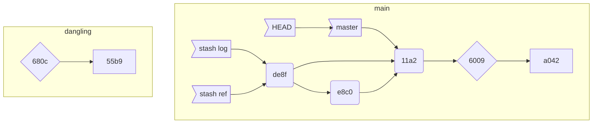

# 我们随手做的 git stash，究竟干了什么？

`git stash` 是程序员的至宝。老板 biangbiang 甩来一个 case，说这个要下班之前 hot fix，咋办，stash，切到 release 对应的分支，缝缝补补；产品 kuangkuang 砸来一个需求更新，说这个简单，小哥哥帮帮我先做了，咋办，stash 切一个新的 feature 分支，撸袖子干。如果没有 `git stash`，人生至少要灰暗一半。

git 执拗，如果你手头上的活没提交，它拒绝切换分支的请求 —— 这挺合情合理，因为切换分支（其实就是切换到历史上的某个 commit，如果 `git checkout -b` 就建立一个 ref 指向当前 `HEAD`）涉及到工作目录的更新，以及 git 索引的重建，如果当前的工作目录修改了，git 总不能将你辛辛苦苦的成果抹去吧。

所以 `git stash` 显得格外亲切。它帮你把手头未完成还不好提交（提交必然牵扯 commit-hook，又是运行单元测试又是静态检查的）的活收拢到一个暂存区，等新任务完成了可以再 `git stash pop` 恢复之前的工作。它的产品机理，像极了 CPU 的 exception，所以说程序员来来回回就那么几出戏，只不过在不同的场景下粉饰一下改头换面上演而已。

那么，`git stash` 背后究竟干了什么？这其实是我在推进 gitrocks 需要探索的。来来来，动次打次，动次打次，敲起你的茶柚，抖起你的肩儿，我们一起 type（wow, you can really type~）。

## 第一遍尝试

建立一个新的 repo，`git add hello.txt` (内容：`hello world!\n`)，然后 `git commit -a -m "init commit"`。之后再 `git ad goodbye.txt` (内容：goodbye world!)。这些操作依次完成后，整个 objects / logs / refs 目录长这样：

```bash
    logs
          HEAD
          refs
              heads
                  master
    objects
          11
                a295f9eedc7635bce94d7d2f82328fa5032ed1
          55
                b909b4a7cad81fe818b364959775188bfccf3d
          60
                09101760644963fee389fc730acc4c437edc8f
          a0
                423896973644771497bdc03eb99d5281615b51
          info
          pack
    refs
        heads
              master
        tags
```

我们查看一下 init commit：

```bash
$ git cat-file -p 11a2
tree 6009101760644963fee389fc730acc4c437edc8f
author Tyr Chen <tyr.chen@gmail.com> 1574787652 -0800
committer Tyr Chen <tyr.chen@gmail.com> 1574787652 -0800
gpgsig -----BEGIN PGP SIGNATURE-----

 iQB1BAAWCAAdFiEEDAfXiyARvxtLDYya/74NqNQekKwFAl3dWksACgkQ/74NqNQekKzqAgD9HCMmZOL6JRNZZd1jKoDXR8d65q0/aIgeOFQ5SHcdFzUBAMcQypPkhC9dSmV3PydpnddnIp03I6Fja1d2O+bF3nsP
 =VDnV
 -----END PGP SIGNATURE-----


init commit
```

接着我们试着 `git stash` 一下，神奇的事情发生了！`logs/refs` 下多了 `stash` 引用，而 `objects` 下哐哐哐整出来三个新的对象：

```bash
    logs
          HEAD
          refs
              heads
                    master
              stash
    objects
          11
                a295f9eedc7635bce94d7d2f82328fa5032ed1
          55
                b909b4a7cad81fe818b364959775188bfccf3d
          60
                09101760644963fee389fc730acc4c437edc8f
          68
                0c79419d0067c90c1103329d9e1effef0fd216
          a0
                423896973644771497bdc03eb99d5281615b51
          de
                8fcd1649da1ab5a6694622508c0e95178ddd02
          e8
                c012220c2e1116ffa1de1264773bd92d31f36b
          info
          pack
    refs
        heads
              master
        stash
        tags
```

我们看看这几个新的对象是什么东东。

`680c` 是一棵包含了 `hello.txt` 和 `goodbye.txt` 的树。正常来说，只有当 commit 时，这棵树才会产生：

```bash
$ git cat-file -p 680c
100644 blob 55b909b4a7cad81fe818b364959775188bfccf3d    goodbye.txt
100644 blob a0423896973644771497bdc03eb99d5281615b51    hello.txt
```

`de8f` 有点意思，它是一个 commit，commit 消息是 `WIP on master: 11a295f init commit`：

```bash
$ git cat-file -p de8f
tree 680c79419d0067c90c1103329d9e1effef0fd216
parent 11a295f9eedc7635bce94d7d2f82328fa5032ed1
parent e8c012220c2e1116ffa1de1264773bd92d31f36b
author Tyr Chen <tyr.chen@gmail.com> 1574787769 -0800
committer Tyr Chen <tyr.chen@gmail.com> 1574787769 -0800

WIP on master: 11a295f init commit
```

这里 `11a295f` 就是上文 `git cat-file -p 11a2` 那个 commit。可以看到，这个 commit 并没有我的 GPG 签名。

`e8c0` 让有有点摸不着头脑，它也是一个 commit：

```bash
$ git cat-file -p e8c0
tree 680c79419d0067c90c1103329d9e1effef0fd216
parent 11a295f9eedc7635bce94d7d2f82328fa5032ed1
author Tyr Chen <tyr.chen@gmail.com> 1574787769 -0800
committer Tyr Chen <tyr.chen@gmail.com> 1574787769 -0800

index on master: 11a295f init commit
```

仔细比较 `de8f` 和 `e8c0`，我们发现，除了 commit 消息不同之外，`de8f` 还多了一个 `parent` 指向 `e8c0`。

我们再看新增的 `.git/logs/refs/stash` 里存了什么：

```bash
$ cat .git/logs/refs/stash
0000000000000000000000000000000000000000 de8fcd1649da1ab5a6694622508c0e95178ddd02 Tyr Chen <tyr.chen@gmail.com> 1574787769 -0800    WIP on master: 11a295f init commit
```

以及 `.git/refs/stash`：

```bash
$ cat .git/refs/stash
de8fcd1649da1ab5a6694622508c0e95178ddd02
```

最后看看 master 指向哪里：

```bash
$ cat .git/HEAD
ref: refs/heads/master
$ cat .git/refs/heads/master
11a295f9eedc7635bce94d7d2f82328fa5032ed1
```

这下子整个脉络就清晰了。各个对象之间的关系是：



我们再看看 `git stash pop` 会发生什么：

```bash
    logs
          HEAD
          refs
              heads
                  master
    objects
      jec 11
                a295f9eedc7635bce94d7d2f82328fa5032ed1
          55
                b909b4a7cad81fe818b364959775188bfccf3d
          60
                09101760644963fee389fc730acc4c437edc8f
          68
                0c79419d0067c90c1103329d9e1effef0fd216
          a0
                423896973644771497bdc03eb99d5281615b51
          de
                8fcd1649da1ab5a6694622508c0e95178ddd02
          e8
                c012220c2e1116ffa1de1264773bd92d31f36b
          info
          pack
    refs
    ref heads
          ads master
        tags
```

`.git/logs/refs/stash` 和 `.git/refs/stash`没了。其它没有变化。

作为一个较真的程序员，我们继续 `git stash`，照理来说，新的 stash 应该只产生新的 `.git/logs/refs/stash` 和 `.git/refs/stash` 文件，不会再产生新的 commit 了，然而，git 依旧固执地同样产生了两个新的 commit：

```bash
$ git cat-file -p 9a06
tree 680c79419d0067c90c1103329d9e1effef0fd216
parent 11a295f9eedc7635bce94d7d2f82328fa5032ed1
parent 7bb55ed97e4d922a2e2ae04bf2f2f7e04807f5de
author Tyr Chen <tyr.chen@gmail.com> 1574788382 -0800
committer Tyr Chen <tyr.chen@gmail.com> 1574788382 -0800

WIP on master: 11a295f init commit

$ git cat-file -p 7bb5
tree 680c79419d0067c90c1103329d9e1effef0fd216
parent 11a295f9eedc7635bce94d7d2f82328fa5032ed1
author Tyr Chen <tyr.chen@gmail.com> 1574788382 -0800
committer Tyr Chen <tyr.chen@gmail.com> 1574788382 -0800

index on master: 11a295f init commit
```

这次我们驾轻就熟：

```bash
$ cat .git/logs/refs/stash
0000000000000000000000000000000000000000 9a063baa8146a819548b0a59e27180ac6951ba3c Tyr Chen <tyr.chen@gmail.com> 1574788382 -0800    WIP on master: 11a295f init commit

$ cat .git/refs/stash
9a063baa8146a819548b0a59e27180ac6951ba3c

$ cat .git/refs/heads/master
11a295f9eedc7635bce94d7d2f82328fa5032ed1
```

有了这些信息，我们再次梳理一下现在 DAG 的样子：


我们把 `goodbye.txt` `stash pop` 出来，然后 `git commit -m "second commit"`：

```bash
$ git cat-file -p b139
tree 680c79419d0067c90c1103329d9e1effef0fd216
parent 11a295f9eedc7635bce94d7d2f82328fa5032ed1
author Tyr Chen <tyr.chen@gmail.com> 1574789596 -0800
committer Tyr Chen <tyr.chen@gmail.com> 1574789596 -0800
gpgsig -----BEGIN PGP SIGNATURE-----

 iQB1BAAWCAAdFiEEDAfXiyARvxtLDYya/74NqNQekKwFAl3dYeMACgkQ/74NqNQekKzuEQEAnpcMk/EBPhARtgKU+EplxhMUuJJOaFdka9bk2c22nL8BALaFzvsUlUdSwvZjFRrjW623Z0CktaIumyHpFefcGbME
 =vT0q
 -----END PGP SIGNATURE-----


second commit

$ cat .git/refs/heads/master
b1390fc37a960f97e9e637c3f82315da94120167
```

可以看到，新生成了 `b139` 这个 commit。master 指向了它。

最后，我们来看看如今的 DAG：


为什么 `git stash` 会生成两个 commit 呢？我们继续探索。

## 第二遍尝试

由于之前的 repo 对象结构已经足够复杂，我们换个目录生成一个新的 git 仓库。然后我们还是重复刚才的动作：添加 hello.txt，commit，然后添加 goodbye.txt。这时数据库长这个样子：

```bash
    logs
          HEAD
          refs
              heads
                  master
    objects
          55
                b909b4a7cad81fe818b364959775188bfccf3d
          60
                09101760644963fee389fc730acc4c437edc8f
          a0
                423896973644771497bdc03eb99d5281615b51
          c6
                2f16377b077275eace0239f24504becc359763
          info
          pack
    refs
        heads
              master
        tags
```

我们修改一下 `hello.txt`，使其变成：`hello tyr!`。`git status` 会告诉我们一个文件在 staging 一个没有：

```bash
$ git status
On branch master
Changes to be committed:
  (use "git restore --staged <file>..." to unstage)
    new file:   goodbye.txt

Changes not staged for commit:
  (use "git add <file>..." to update what will be committed)
  (use "git restore <file>..." to discard changes in working directory)
    modified:   hello.txt
```

让我们深吸一口气，`git stash`：

```bash
    logs
          HEAD
          refs
              heads
                    master
              stash
    objects
          27
                8efbd09a21dbd2b443bd7a879013abfee434ca
          55
                b909b4a7cad81fe818b364959775188bfccf3d
          60
                09101760644963fee389fc730acc4c437edc8f
          62
                d7bceb43b713c838ce04075fa23fb263aa01f5
          68
                0c79419d0067c90c1103329d9e1effef0fd216
          a0
                423896973644771497bdc03eb99d5281615b51
          a4
                f7a95ef0b8dcbb8d89af09a488f7cb3166fadc
          c3
                efe55f18835756842af5f53a64d1d78dc5ed6c
          c6
                2f16377b077275eace0239f24504becc359763
          info
          pack
    refs
        heads
              master
        stash
        tags
```

多了五个对象！我们探索一下：

```bash
$ git cat-file -p 278e
tree 680c79419d0067c90c1103329d9e1effef0fd216
parent c62f16377b077275eace0239f24504becc359763
author Tyr Chen <tyr.chen@gmail.com> 1574791207 -0800
committer Tyr Chen <tyr.chen@gmail.com> 1574791207 -0800

index on master: c62f163 init commit

$ git cat-file -p 62d7
100644 blob 55b909b4a7cad81fe818b364959775188bfccf3d    goodbye.txt
100644 blob c3efe55f18835756842af5f53a64d1d78dc5ed6c    hello.txt

$ git cat-file -p 680c
100644 blob 55b909b4a7cad81fe818b364959775188bfccf3d    goodbye.txt
100644 blob a0423896973644771497bdc03eb99d5281615b51    hello.txt

$ git cat-file -p c3ef
hello tyr!

$ git cat-file -p a4f7
tree 62d7bceb43b713c838ce04075fa23fb263aa01f5
parent c62f16377b077275eace0239f24504becc359763
parent 278efbd09a21dbd2b443bd7a879013abfee434ca
author Tyr Chen <tyr.chen@gmail.com> 1574791207 -0800
committer Tyr Chen <tyr.chen@gmail.com> 1574791207 -0800

WIP on master: c62f163 init commit

$ cat .git/refs/stash
a4f7a95ef0b8dcbb8d89af09a488f7cb3166fadc

$ cat .git/logs/refs/stash
0000000000000000000000000000000000000000 a4f7a95ef0b8dcbb8d89af09a488f7cb3166fadc Tyr Chen <tyr.chen@gmail.com> 1574791207 -0800    WIP on master: c62f163 init commit
```

这下清楚了，commit `a4f7` 使用了 `62d7` 这棵树，而 commit `278e` 使用了 `680c` 这棵树。`62d7` 里面包含的是更改过的 hello.txt，stash 引用指向了 `a4f7`。我们看图更直观：


也就是说，当我们做 `git stash` 时，stash 了两类数据：

* staging 区域内的数据（goodbye.txt）
* working 区域内的数据（修改了的 hello.txt）

## 为什么这么设计？

开始我对此非常不解，这种还未完成的工作，就这样了咣咣塞到了不可修改的对象数据库中，不浪费资源么？为什么不直接放在一个 stash 目录中了事呢？在做 gitrocks 里，我探索过一些「聪明」的方案，比如放在一个目录中，扔在 sqlite 里等等，结果越深入，越发现 git 是对的。git 的用户可能像你我一样一天在若干个分支中天马行空恣意妄为，如果所到之处都 `git stash` 一下到此一游，那么，势必要记录 parent commit，要为 stash 生成一颗树来保存目录结构，要把修改的文件存入某处 —— 而所有这一切，其实 commit 的代码已经很好地实现了，用一套代码解决两个问题，简单中透着美。此外，生成的 commit 虽然最后没有用，但中间的树和子树很大机会可以被复用，那么，之前的运算并没有白费功夫。最后，git 还提供 gc，把 `git stash pop` 之后「绕树三匝，无枝可依」的孤儿们回收掉，节省空间。

花了将近两个小时探索，我平静地接受了这样一个事实：你大爷还是你大爷。git 设计上的精巧还需要认真琢磨。子曾经曰过：「吾有知乎哉？无知也」。连夫子都这么谦恭，我还得努力啊。
