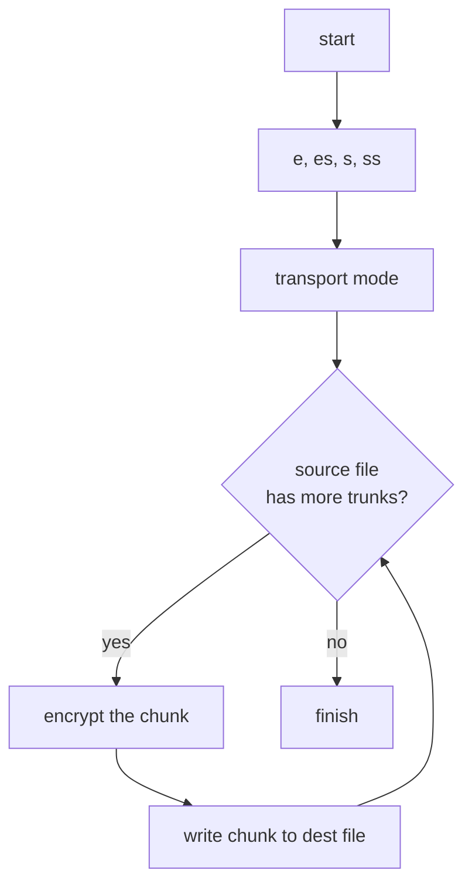
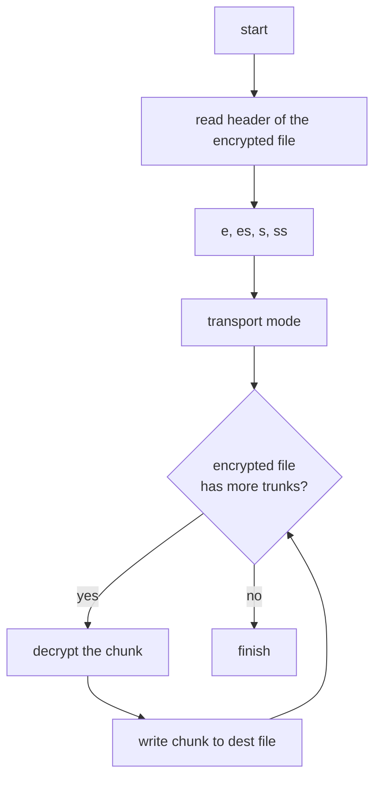

# 用 noise 协议的思路来点对点加密文件？

在之前介绍 noise 协议的时候，我写了这样一种应用方案：

> 此外，Noise 协议还可以用于加密文件 —— 只要我有你的公钥，我可以使用单向握手（7.4）加密某个文件（附带握手时发送的消息），然后传输到某个不安全的位置（比如网盘，FTP，IPFS，甚至区块链中），该文件只有拥有私钥的人才能解密。这种应用很有意思，因为它具备非对称加密的安全性，同时又具备对称加密的加解密速度。

后来重读这段的时候，我突然发觉，这是个很有意思的思路，搜了一圈，似乎没有人这么干，于是决定自己撸袖子试试。正好，rust 下面有一款很赞的 noise 协议的实现：[snow](https://snow.rs)，libra 也在使用这个库（通过 rust-libp2p），于是我便用 snow 展开尝试。

## 模式的选择

Noise 协议 7.4 里提到有几种 "one-way handshake"：N, K, X：

* N：发送方不使用静态密钥对
* K：接收方预先知道发送方的静态公钥
* X：发送方的静态密钥对通过网络加密传输给接收方

无论是哪一种，发送方在握手时都需要接受方的静态公钥。这几种模式无非就是发送方的公钥怎么提供给接收方。模式 N 其实就是最传统的基于 DH 的公钥加密算法，它并没有提供对发送方的认证 —— 接收方即便能够解密收到的内容，但她无法确认内容的来源可信，所以并不完美；而模式 K 和 X 没有这个问题，但模式 K 对接收方的要求太高，实际应用场景有限，因而，在握手过程中传递公钥的模式 X 就成为我的首选（而且是唯一选择）。

模式 X 的握手方式：

```noise
<- s
...
-> e, es, s, ss
```

注意，这里我们虽然使用了「握手」这个词，实际上它是发送方单向决定的，没有真正的握手过程。发送方只需要生成临时的密钥 e 的公钥，然后对 e 和对方的公钥做 DH，用 DH 的结果加密自己的公钥，然后用自己的公钥和对方的公钥做 DH，整个过程中生成的密钥就是接下来加密所需的密钥。

## 如何用这个模式加密文件？

Noise 协议的主要应用方向是保障网络流量的安全，所以协议里一次能够处理的最大的消息是 65535。为什么呢？因为这是一个逻辑 IP 报文的最大长度（物理上，根据 MTU - Max Transmit Unit 的大小，IP 包会被切成若干个分片，比如以太网的 MTU 是 1500）。由于加密后的报文比加密前增加了一段 16 个字节的 AEAD（Authenticated Encryption with Associated Data） 的校验数据，所以实际加密前的大小是 65535-16。这就意味着文件需要切成 65519 的块，才能满足加密后的最大长度。

于是，我们可以得到这样一个加密流程：



现在问题来了，数据是加密好了，那接收方如何解密这个数据呢？这得好好琢磨。

我能想到的最好的思路是，把发送方握手期间生成的握手信息序列化写到加密的文件头中，这样接收方就可以读出这个握手信息，从而建立对应的握手状态，然后切换成传输模式，进行解密。

## 加密文件的文件头如何设计？

考虑到未来潜在的升级，文件头我使用了 protobuf。我也考虑过 capnp 和 flatbuffers，它们有一些难以抗拒的优点（比如 zero-copy，以及可以局部读取内容而不必像 protobuf 一样必须读取整个结构才能 decode），但一来 protobuf 简单直接，二来消息安全程度更高（毕竟需要 encode / decode 预处理一下），三来对我这个应用 protobuf 在效率上的劣势几乎可以忽略不计，所以我使用 protobuf，定义如下：

```protobuf
syntax = "proto3";
package header;

enum CipherMode {
  ChaChaPoly = 0;
  AESGCM = 1;
}

enum HashMode {
  BLAKE2b = 0;
  BLAKE2s = 1;
  SHA512 = 2;
  SHA256 = 3;
}

// this is the file header for encrypted files. Note that we deliberately fixed
// the DH function to ed25519 since it provides same level of security as ed448,
// but performance is better. The default choise of if all the parameters are
// default value: Noise_X_25519_ChaChaPoly_BLAKE2b. This fits the most of the
// security standards. However, initiator and responder can use a pre shared key
// for extra level of security.
message Header {
  // cipher function used by noise protocol
  CipherMode cipher = 1;
  // hash function used by noise protocol
  HashMode hash = 2;
  // if true, we will do a Xpsk1. Note user shall provide the psk upon Session::new.
  // <- s
  // ...
  // -> e, es, s, ss, psk
  bool use_psk = 3;
  // handshake message from the initiator
  bytes handshake_message = 4;
}
```

其中这里的 `handshake_message` 就是发送方生成的握手消息。

有的同学也许会有疑问：把握手消息放在文件头，会不会不安全？

没问题。首先，握手的过程本来就是在不安全的互联网上传输的，放在文件头和放在网络中，不安全的程度是一致的；其次，握手过程会传什么，是协议规定好的，任何人都可以从中解析出临时生成的密钥对 e 的公钥，但是因为它没有私钥，所以无法算出 DH(e, s)，后续的步骤就都无法得出。所以这个过程是安全的。

## 接收方如何解密？

如果你跟到了这一步，想必解密的流程你已经了然于胸：



## 和传统的对称加密方式比较

传统的对称加密方式（比如 AES-256 或者 ChaChaPoly）最大的问题是密钥：如果每次加密使用相同的密钥，那么任一密钥的泄露或者被暴力破解会导致所有使用该密钥的加密文件失去保护；如果每次使用不同的密钥，则大大加重了密钥保管和解密的负担（需要知道哪个文件对应哪个密钥）。而如果使用 Noise Protocol 或者直接使用 DH 算法，单方面「协商」密文所需的密钥，每次加密会生成完全随机的密钥，因而只要接收者的私钥不泄露，安全性和可用性都比传统的方式要好。此外，接收者还可以验证密文来自于它信任的发送方。这种方式唯一的缺憾是密文比原文长了一个大约 100 字节的文件头以及每 64k 多一个用于校验的 HMAC。但这是可以接受的妥协。

## 源码

想看具体实现的可以去：github.com/tyrchen/conceal。这个代码去年 12 月中就写好了，后来想用 mmap 优化文件读写效率，无奈卡在 mmap 的写入问题上，一直没工夫解决（见 Pull Request），就搁下了。master 上的未优化代码工作正常，供大家参考。
