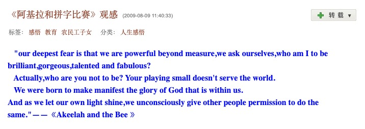

# 《阿基拉和拼字比赛》观感

最近小宝参加钢琴比赛铩羽而归，好几天闷闷不乐。宝妈为了开导她，特地找了一部励志电影《阿基拉和拼字比赛》，我们全家人一起看。小宝看得很认真，我也从中汲取了不少力量 —— 尤其是和谐的家庭对孩子的重要性。本来想写上几句，建议身边有娃的朋友们也带着娃一起看看，宝妈说她 09 年看得这部片子，当时感动地一塌糊涂，写下了自己的第一篇博客 —— 在征得她同意后，我得以将其发在这里。本文的所有打赏归宝妈所有，特此声明。

---

> our deepest fear is that we are powerful beyond measure, we ask ourselves, who am I to be brilliant, gorgeous, talented and fabulous? Actually, who are you not to be? Your playing small doesn't serve the world. We were born to make manifest the glory of God that is within us. And as we let our own light shine, we unconsciously give other people permission to do the same. - "Akeelah and the Bee"

今天在电影频道看了一部06年好莱坞的电影，叫《阿基拉和拼字比赛》，很感人，很有教育意义。它讲述的是一个11岁的小女孩，在6岁父亲去世后十分伤心，后来发现参加拼字游戏不断地被单词可以使她减轻痛苦，所以不断记单词玩拼字游戏而有机会代表学校参加拼字比赛，经过一步步的备赛比赛，在教授的带领下，在朋友的鼓励和后来家人的支持下，她最终取得了成功。故事给我的感悟如下：

1. 每个人最惧怕的不是别人（如对手），也不是某个事情（如比赛），而是他自己。只要能够战胜对自己的恐惧，不自信，就会取得成功。

2. 家庭对于一个小孩子是多么的重要。这是在最开始我的感受，她的妈妈有好几个孩子，其中一个儿子每天和小混混在一起。当 AKEELAH 和妈妈多次谈起要参加拼字比赛时，妈妈不是不想听就是坚决拒绝她去参加比赛。虽然后来渐渐了解了这位母亲的苦衷，但是，我仍然相信，如果开始她的妈妈就能够支持她，也许她会更早更易成功。我经常感叹有很多家里没有钱的小孩没有成功，甚至走上歧途，其实并不是因为他们的家庭没有钱无法给予他们很多物质支持，而是这样的家庭父母往往不会教育孩子，埋没了很多可能成功的小孩。这也是为什么我向往公益事业，最近关注农民工子女教育和成长的原因。（可惜我还没有找到直接尽自己之力的机会，所以还只是在关注阶段。）

3. 爱的重要性。在影片的后半段，AKEELAH 的教练不愿意继续教她时，她的妈妈对她说你的身边都是「老师」，电影表现了很多镜头来讲述 AKEELAH 是如何记住最后的最难的5000单词的，是那些身边的“老师”，有同学，有杂货店的老大爷，有餐馆的员工，有路人，有小混混，还有家人。每一个人都可以成为你成功的伴侣和导师。

4. 我觉得准备拼字比赛是很无聊的东西，无数生僻难词要记，记住了有什么用呢？故事告诉我们，在你准备无聊的比赛的时候，换个角度，它就会变成有意思的事。 AKEELAH 的教练不是让她为了比赛而背词，而是让她先读一些优秀的文章，故事中 AKEELAH 和其他队友的友谊，包括最后为了让一个原来是竞争对手的男孩不再在最后一次比赛机会中仍做第二名， AKEELAH 故意背错词，而那个男孩也不愿这样成为第一名（这告诉了我们善良，诚实和尊严），这些都是她的收获，也是作为观影者的我的收获。

5. 成功，一个导师是多么重要。他教会我们取得目标的方法，更重要的是他帮助我们了解什么是自己的目的。这影片也显示了中国式教育的弊端，AKEELAH 最大对手华裔男孩的父亲非常严厉，让他无论如何也要成功，在决赛前一天别人都放松游玩他还在父亲督导下继续背单词。因为他父亲也只看到了比赛得第一本身，而忽略了参加比赛的目的和意义。

6. 帮助别人的人，会有很多朋友。AKEELAH 刚参加比赛很紧张，一个小男孩主动和她聊天，鼓励她，告诉她TIPS，后来他们成为了好朋友。AKEELAH 另一个对手则因为父亲的严厉期待只是刻苦背单词，虽然他很强，但是不幸福。后来在 AKEELAH 的帮助下，他们两个成了朋友，互相鼓励，最终共同取得了成功。这也让我看到了双赢的结果。

7. 尊重别人，多和别人交流，每个人的生活都很精彩，每个人都可能是你的老师。AKEELAH 的哥哥和当地一个黑帮头头厮混，但是就是这个人，告诉 AKEELAH 他曾经写诗得过第一。让人很意外哦，也很让人感动。

8. AKEELAH 取得决赛资格时，成了当地的名人，记者采访她，很多同学崇拜她，她成了一个小明星。我还真是有些替她担心。现实中，很多新明星（其中不乏成年人），很多少年班的才子们，最后就是被外界披上的光环迷失了自我。他们可能只看到了月亮就觉得自己已经很闪耀，结果失去了看到太阳的机会。很高兴 AKEELAH 没有迷失，她知道自己在做什么，也知道谁对自己是最重要的人，所以她成功了。我想到那句话：To be the best of yourself.快要迷失时，这句话就够了。

9. AKEELAH 对父亲的感情，可能不是所有人能够感受到。他是她的精神支柱。这部电影最触动我的片段，就是 AKEELAH 抬头对空中笑着说，我做得还不错吧。亲人尤其是至亲去世，一辈子的痛。但是想想他反倒可以时时在我们身边，时时鼓励着我们，时时和我们交流，也是失去的幸福。我从 AKEELAH 看到了坚强，乐观和幸福。

这就是一部普通的励志电影给我的感受。它细腻地通过一个小女孩的成长教会了我如何成长。

P.S. 里面的单词真的是超级无聊超级难啊。最想记住两个：

1. 美丽：p-u-l-c-h-r-i-t-u-d-e
2. 爱：L-O-V-E
