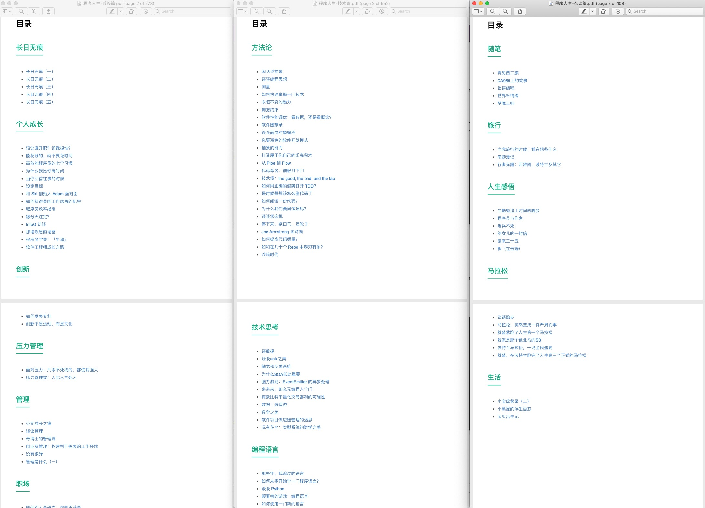

# 致敬时间的价值：一品十年

> 江汉曾为客， 相逢每醉还。
>
> 浮云一别后，流水十年间。
>
> 欢笑情如旧，萧疏鬓已斑。
>
> 何因不归去？ 淮上有秋山。
>
> —— 韦应物《淮上喜会梁州故人》

## 回顾

对我而言，2010 年是个奇妙的起点。在 Juniper 工作了六年之后，我萌生了出去闯荡一番的想法。我一边参加创业竞赛，一边把想法化作代码，最终在 2011 年 —— 中国移动互联网元年 —— 开始了一段跌宕起伏的创业历程（详情见：《途客圈创业记》）。

2012 年，在创业最艰难的时刻，我的第一个小天使 —— 小宝出生了。

2013 年 4 月，创业失败，公司贱卖，我回到阔别两年多的 Juniper。在体验了国内的创业环境之后，我心中有一个强烈的愿望：有朝一日可以去硅谷感受美国的工作和创业环境。

2014 年 12 月底，在多番折腾之后，我和家人终于拿着 L1/L2 签证，飞抵旧金山。

2015 年 3 月，经老板同意，我离开了安逸的 Juniper 总部，来到旧金山的一个略显孤单的做 web 安全的办公室 —— 这是 Juniper 收购的一家创业公司。

2015 年 8 月，在朋友大力举荐下，我接受了 Tubi 的工作机会。随后惴惴不安地在律师的帮助下，申请 O1 签证。

2015 年 11 月，年初 H1b 没有抽中的尴尬变成了年末拿到 O1 的喜悦；我终于可以跳槽到 Tubi，在一个纯互联网的环境中大展拳脚。在我的第一次 all-hands meeting 上，我跟整个团队分享了我的目标，我希望引入的工程师文化，以及 Shlemiel the painter’s algorithm 和 4-minute mile 两个有趣的小故事。在 Tubi，我做的第一个改变，就是把之前在 Juniper 和途客圈都行之有效的午间分享（BBL）引入到 Tubi，为工程团队，甚至整个公司拓展知识面。我给团队做了 ES6 的培训，引入了 promise 和 observable 的思想，我的同事 Zhiye 分享了 ava，ops 团队的 Tim 给大家讲了 HLS / MPEG4 等编码方式，等等。

2016 年马老师作为 CTO 加入 Tubi，我们一起带领着 Tubi 的工程团队，把服务端的老旧的 php 和 es5 javascript 的代码一点点换做 es6 javascript，并且跑在了我新做的一套 API 系统 UAPI 上。UAPI 和之前的遗留系统并行运行了一段时间后，最终，所有 API 顺利迁移完毕，遗留系统淡出历史舞台。这次迁移之后，服务速度上升了一个量级，而代码量极度降低（很多重复的逻辑都用更好的编程思想封装和处理），代码质量大大提高。

2016 年 6 月，我的 EB1A 总算开始处理，回美证一到手，我便飞回北京，创建了 Tubi 的中国团队。我跟公司 CEO/CTO/COO 达成的共识是：这支团队不是美国团队的补充或者延伸，而是和美国团队同等「待遇」的核心团队。随后经过不到一年的发展，这支团队迅速成长为 Tubi 工程团队中最得力的团队，承载了大量的核心的研发任务和产品。

2016 年 9 年，我生命中的第二个小天使 —— 小贝呱呱落地。

2017 年初，我尝试把 Elixir 引入 Tubi —— 不光是 Elixir，还有很多软件开发的思维方式。我用 Elixir 写的 Policy Engine 把我用 Jison（一个 javascript 版本的 Flex/Bison） 写的 rule parser 效率提升了两个量级，从而奠定了在团队中推广 Elixir 的基础。随后我们在后端逐渐增加 Elixir 和 Scala 的占比：Elixir 做服务端开发，而 Scala 用来开发广告系统。

2017 年整一年是我 devOps 能力大跃进的一年 —— 之前只系统写过 ansible 的我，逐渐演进成 ansible 和 terraform 的小能手。在 Tubi，工程师要对自己的服务负责到底：从服务的撰写，到部署上线，到监控和后续的迭代。我们还将全部服务一点点 GRPC 化 —— 让 GRPC 像血管一样注入和连接各个服务。在此基础上我们引入了 sidecar，负责流量管理，复杂均衡和断路器等功能。

2018 年初，我们集大部分工程团队的力量，把所有的服务从 aws 的一个数据中心迁移到另一个数据中心。迁移的主要目标是把 devOps 全部脚本化，实现「基础架构即代码」（Infrastructure as Code）。一个季度的辛劳换来了巨大的成果，这个项目为公司未来两三年甚至更久的扩容奠定了坚实的基础。与此同时，我们开发了高并发的转码工具 —— 一个视频文件可以被拆分成任意多的片段，分别转码，然后重新组装。在业界，似乎只有 netflix 具备这个能力。

在 Tubi 度过了美妙的两年半后，2018 年 5 月，我加入 ArcBlock，迁居西雅图，开始了在区块链技术上的漫长探索。受限于团队的规模，从一开始，我就把自动化做到极致来减少人力成本 —— 我做了一套 Elixir 下的 DSL，可以从 protobuf 的定义文件起，生成 GraphQL 的接口（可选），GRPC 的接口，数据库的 schema 代码（可选），以及文档。通过这套 DSL，我们的工程师可以快速迭代 API，并在 API 稳定后，只需要实现一套逻辑，就可以同时拥有内部接口，服务间的 GRPC 接口，以及对外的 GraphQL 接口。由于没有 devOps 工程师，我用 gruntworks 的模块一手搭建了我们整个 devOps 的平台 —— 这是我第一次尝试在 AWS 上使用三层子网以及多 VPC 搭建整个云端的架构，它吸取了我从 Tubi 学到的很多经验教训，在自动化，安全和可用性上达到了一个不错的平衡。

2018 年年底，带着对区块链逐渐成熟的认知，我带领团队开始从一个 PoC 慢慢演进我们自己的应用开发框架 —— Forge 框架，日以继夜地，直至 2019 年 3 月，有了一个像样的版本。

2019 年是起起伏伏的一年。在区块链项目上做得越久，我越欣赏 git 的优雅，质朴和包容。我构思了一本并没有开始撰写的关于区块链的技术书籍 —— 大部分内容都在介绍那些不起眼的，但是奠定了区块链基础的技术：比如公钥加密/签名，哈希算法，有向无环图，沙米尔算法，Paxos/Raft 共识算法等等。我觉得相对于那些花里胡哨的激励机制，扑朔迷离的共识算法，这些才是真正有生命力的技术。人们总是错误地将手段当做目标，回归比特币最初的那些目标，相关的手段才显得有意义；而如果目标不同，却强行应用相同的手段（比如说矿工），就舍本逐末了。

9 月份，一次家长会，让我把对孩子的愧疚转化成动力，开始了匀出每晚半个小时到一个小时时间给小宝上课的尝试。三个月下来，小宝已非吴下阿蒙，我也非吴下阿蒙。​我暗自赞叹「每个孩子都有成为天才的潜力，就看这潜力如何在成长中兑付」。就拿跑步这件小事来说吧 —— 我记得初高中体育课跑个一千五百米自己都要累得吐血，现在小宝几乎每个周末早上 7 点半左右都会起来跟我去跑 3.5km。跑步不光锻炼身体，还能磨炼毅力，心性，更重要的是，它是父女俩独处聊天的绝佳时刻。

10 月份，我跑出了人生最完美的一次马拉松，用时 4 小时 32 分。三十七岁的自己，终于超越了三十二岁的自己的脚步。

2019 年最后的日子我还干了一件自以为了不起的「大事」—— 因为 Github 慷慨的代码永久保存计划「arctic code vault」，我开始把之前散落在三四个 repo 里的所有我曾经发表过的近四百篇文章精选出来值得保留的一百多篇集结到目前正在使用的 book_next repo 中，然后将其开源。这个 repo 编译出来的 pdf，有 900 页之多，我将其编译成三个 PDF，分成「技术篇」，「成长篇」和「杂谈篇」，算是我过去六年人生的一个回顾和总结。

感兴趣的同学，可以去 github.com/tyrchen/book_next 下载（记得给我 star 哦）。

## 展望

2019 年最后一个周末和小宝跑步的时候，我们展望了下一个十年。十年后，小宝将年满 17 岁，成为一名大学生。

记得有一次小宝问我：如果我去清华当老师，教钱三一这样的学生，是不是要学到博士啊？我说是。她说：爸爸，等我高中了，要不我们回北京吧，我要考清华，然后一直在清华读到博士，那样就可以在清华教书了。我乐了，告诉她：大学为了防止近亲繁殖（我给她的解释在此略过），自己学校培养的博士是不能留校任教的。所以你到清华任教，不能是清华博士毕业。她说：那我就上斯坦福，读到博士，清华会要我么？我哈哈大笑：如果那样，除了斯坦福，你想去哪个学校任教都没问题​啦！​

跑步过程中我跟小宝重提了这个话题，问她有多想上斯坦福？她说非常想。我告诉她去斯坦福读书是一个看上去遥不可及，但只要我们共同努力，还是有一些机会的目标。她说那爸爸你就努力赚钱，我就努力学习。我对她说：光是好好学习是远远不够的，你还是要找到你真正喜爱的，吃饭睡觉都会想着的，愿意付出一辈子时光的事情。她问：就像爸爸喜欢编程这样？我点点头，告诉她：接下来的十年是奠定你人生的下限的十年 —— 没人能预测一个人的上限，但往往经过十年二十年，一个人的下限是确定的。所以你要在下一个十年争取尽早找到你真正喜爱的事情 —— 在不断寻找的过程中，我们要广泛地涉猎知识，理解和掌握那些伟大的先贤们 —— 欧几里得，祖冲之，牛顿，迪卡尔，欧拉，爱因斯坦等穷尽一生发现的真理。十年的时间不算长，但也不短，争取十年后，你读过的书，掌握的知识 —— 比如数学，物理，历史这些知识 —— 比爸爸还要丰富，还要扎实；你拥有独立思考和解决复杂问题的能力；拥有强大的意志力，可以克服各种困难，就像跑步一样，咬着牙完成目标；同时拥有强健的身体和成熟的心智。小宝吐了吐舌头，点点头。

对我而言，下一个十年，家庭是首位。自从我发现小宝对数学的独特兴趣以及超出同龄人的思考问题的方式后，我就有种深深的责任感，不要因为自己的不作为埋没了孩子的这份潜力。只要她还愿意学（只要我还有本事勾得住她的兴趣），我就会继续给她晚间授课。除了目前的内容（中国历史，代数，编程，探索，纪录片，几何）外，也许还会加上计算机相关的内容：从发展历史，工作原理到各种有趣的算法。如果她数学的基础打得牢靠，我们还会涉猎更多科学（物理）的话题。

家庭和工作之外，我个人有这样一些大的目标：

* 2020：出版一本有趣且不失严谨，把数学和生活联系起来的数学书。目标受众：爸爸们
  * 2020-2029：如果可能，把《天叔奇谈》其它部分整理成册，出一个系列。
* 2020-2029：做一个拥抱 GIT 思想的分布式账本服务（账本，而非区块链）
* 2020-2024：出版至少两本中文技术书籍（内容待定）。目标受众：程序员
* 2020-2024：出版一本英文技术书籍（内容待定）。目标受众：程序员
* 2025-2029：读一个 PhD
* 2020-2029：六大马拉松至少跑一个（哼，我就不信年年抽，柏林，伦敦，纽约，东京，芝加哥我就一个抽不到？）
* 2020-2029：和小宝/小贝携手跑至少一个半马，一个全马
* 2020-2029：写五百篇文章（基本上，保持一周一篇的节奏）
