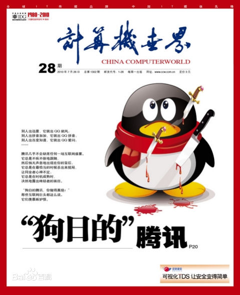

（一）

> 2010 年 10 月底，远在华为中东做销售的 Alex 回国休假。在北京，几个昔日的同学再度齐聚一堂，喝酒聊天，畅谈未来。这次的话题主要围绕着 Alex —— 他被剑桥录取，即将远赴英伦展开他的 MBA 之旅。对于像我这样的土鳖而言，剑桥就像一个遥不可及的梦。听着他侃侃谈着自己是如何在工作之余刻苦努力，为梦想拼搏时，我的心绞痛着——不是嫉妒，不是羡慕，而是怒己不争 —— Alex 可以为了自己想要的生活付出一切，我却把自己 07 年就萌生的创业梦想一点点消磨，然后套牢。
>
> 节选自《途客圈创业记：不疯魔不成话》

2010 年在中国互联网的历史上，是浓墨重彩的一年。年初王兴成立美团，是当时百团大战中不算太耀眼的一员。如今美团点评成长为 BAT 外的新一极，而她所效仿的鼻祖 Groupon 已经快泯然众人矣。

年中，《计算机世界》用一只身中多刀，鲜血淋淋的企业为封面，头条文章《狗日的腾讯》辛辣地批判当时互联网头号公敌：腾讯。

年尾第二届淘宝双十一如同超女一样引爆，单日 10 亿元的销售使其成为现象级的营销；而双十一的热度还没过去，3Q 大战再度把腾讯推向风口浪尖，本属受害人的企鹅由于之前风评太差，加之使用的方式太过武断，逼迫用户二选一，反而在舆论上失了人心。3Q 大战的瓜还没吃完，当当意气风发地上市。上市本来是个平淡无奇的瓜，但其创始人李国庆用其太太拦都拦不住的大嘴和华尔街背后的大摩女微博撕逼直接挑战了全天下吃瓜群众对粗俗的认知。「日中则昃，月满则亏」，在当当最风光的时候，东哥大手一挥发起图书大战，把战火烧向当当后院，同时向全世界展示了一个姿态：我不光是 3C 电商，我要做全品类。

2010 年的互利网界一锅粥似的大乱斗为接下来十年中国互联网的野蛮增长奠定了基础。

## 回顾

对我而言，2010 年是个奇妙的起点。在 Juniper 工作了六年之后，我萌生了出去闯荡一番的想法。我一边参加创业竞赛，一边把想法化作代码，最终在 2011 年 —— 中国移动互联网元年 —— 开始了一段跌宕起伏的创业历程（详情见：《途客圈创业记》）。

2012 年，在创业最艰难的时刻，我的第一个小天使 —— 小宝出生了。

2013 年 4 月，创业失败，公司贱卖，我回到阔别两年多的 Juniper。在体验了国内的创业环境之后，我心中有一个强烈的愿望：有朝一日可以去硅谷感受美国的工作和创业环境。

2014 年 12 月底，在多番折腾之后，我和家人终于拿着 L1/L2 签证，飞抵旧金山。

2015 年 3 月，经老板同意，我离开了安逸的 Juniper 总部，来到旧金山的一个略显孤单的做 web 安全的办公室 —— 这是 Juniper 收购的一家创业公司。

2015 年 8 月，在朋友大力举荐下，我接受了 Tubi 的工作机会。随后惴惴不安地在律师的帮助下，申请 O1 签证。

2015 年 11 月，年初 H1b 没有抽中的尴尬变成了年末拿到 O1 的喜悦；我终于可以跳槽到 Tubi，在一个纯互联网的环境中大展拳脚。在我的第一次 all-hands meeting 上，我跟整个团队分享了我的目标，我希望引入的工程师文化，以及 Shlemiel the painter’s algorithm 和 4-minute mile 两个有趣的小故事。我在 Tubi 做的第一个改变，就是把之前在 Juniper 和途客圈都行之有效的午间分享（BBL）引入到 Tubi，为工程团队，甚至整个公司拓展知识面。我给团队做了 ES6 的培训，引入了 promise 和 observable 的思想，我的同事 Zhiye 分享了 ava，ops 团队的 Tim 给大家讲了 HLS / MPEG4 等编码方式，等等。

2016 年马老师作为 CTO 加入 Tubi，我们一起带领着 Tubi 的工程团队，把服务端的老旧的 php 和 es5 javascript 的代码几乎全部换做 es6 javascript，并且跑在了我新做的一套 API 系统 uapi 上，服务速度上升了一个量级，而代码量大大降低，且清晰明了。2016 年下半年，我生命中的第二个小天使 —— 小贝呱呱落地。

2017 年我尝试把 elixir 引入 Tubi，用 elixir 写的 Policy Engine 把 JS 下用 Jison 写的 rule parser 效率提升了两个量级。随后我们在后端逐渐增加 elixir 和 scala 的占比：elixir 做服务端开发，而 scala 做广告系统。五六月份我的 EB1A 总算排到，回美证一到手，我便飞回北京，创建了 Tubi 的中国团队。2017 年同时是我 devOps 能力大跃进的一年 —— 之前只系统写过 ansible 的我，逐渐演进成 terraform 小能手。在 Tubi，工程师要对自己的服务负责到底：从服务的撰写，到部署上线，到监控和后续的迭代。我们还将全部服务一点点 GRPC 化 —— 让 GRPC 像血管一样注入和连接各个服务。在此基础上我们引入了 sidecar，负责流量管理，复杂均衡和断路器等功能。

2018 年初，我们集大部分工程团队的力量，把所有的服务从 aws 的一个数据中心迁移到另一个数据中心。迁移的主要目标是把 devOps 全部脚本化，实现 Infrastructure as Code。一个季度的辛劳换来了巨大的成果，这个项目为公司未来两三年甚至更久的扩容奠定了坚实的基础。与此同时，我们尝试开发高并发的转码工具 —— 一个视频文件可以被拆分成任意多的片段，分别转码，然后重新组装。在业界，似乎只有 netflix 具备这个能力。

在 Tubi 度过了美妙的两年半后，2018 年 5 月，我加入 ArcBlock，迁居西雅图，开始了在区块链技术上的漫长探索。受限于团队的规模，我不得不把自动化做到极致来减少人力成本 —— 我们做了一套 DSL，可以从 protobuf 的定义文件起，生成 GraphQL 的接口（可选），GRPC 的接口，数据库的 schema 代码（可选），以及文档。通过这套 DSL，我们的工程师可以快速迭代 API，并在 API 稳定后，只需要实现一套逻辑，就可以同时拥有内部接口，服务间的 GRPC 接口，以及对外的 GraphQL 接口。由于没有 devOps 工程师，我用 gruntworks 的模块一手搭建了我们整个 devOps 的框架 —— 这是我第一次尝试在 AWS 上使用三层子网以及多 VPC 搭建整个云端的架构，它吸取了 tubi 的很多经验教训，在自动化，安全和可用性上达到了一个不错的平衡。

2018 年年底，带着对区块链逐渐成熟的认知，我开始从一个 PoC 慢慢演进 Forge 框架，直至次年的三月份有了一个像样的版本。

2019 年是起起伏伏的一年。在区块链项目上做得越久，我越欣赏 git 的优雅，质朴和包容。我构思了一本并没有开始撰写的关于区块链的技术书籍 —— 大部分内容都在介绍那些不起眼的，但是奠定了区块链基础的技术：比如公钥加密/签名，哈希算法，有向无环图，沙米尔算法，Paxos/Raft 共识算法等等。我觉得相对于那些花里胡哨的激励机制，让人眼花缭乱的共识算法，这些才是真正有生命力的技术。人们总是错误地将手段当做目标，回归比特币最初的那些目标，相关的手段才显得有意义；而如果目标不同，却强行应用相同的手段（比如说矿工），就舍本逐末了。

9 月份，一次家长会，让我把对孩子的愧疚转化成动力，开始了匀出每晚半个小时到一个小时时间给小宝上课的尝试。三个月下来，小宝已非吴下阿蒙，我也暗自赞叹「每个孩子都有成为天才的潜力，就看这潜力如何在成长中兑付」。就拿跑步这件小事来说吧 —— 我记得初高中体育课跑个一千五百米自己都要累得吐血，现在小宝几乎每个周末早上 7 点半左右都会起来跟我去跑 3.5km。跑步不光锻炼身体，还能磨炼毅力，心性，更重要的是，它是父女俩独处聊天的绝佳时刻。

2019 年我还干了一件自以为了不起的「大事」—— 因为 Github 慷慨的代码永久保存计划「arctic code vault」，我开始把之前散落在三四个 repo 里的所有我曾经发表过的近四百篇文章精选出来值得保留的一百多篇集结到目前正在使用的 book_next repo 中，然后将其开源。这个 repo 编译出来的 pdf，有 900 页之多，算是我过去六年人生的一个回顾和总结。

感兴趣的同学，可以去 github.com/tyrchen/book_next 下载（记得给我 star 哦）。

## 展望

过去的十年，

随后两年多，在轰轰烈烈的移动互联网革命中，我和我的团队起起伏伏。
