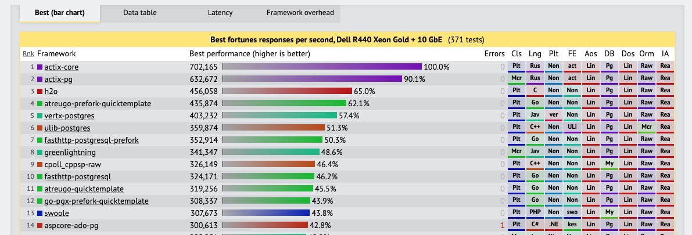

# 暴走的程序员

今天一篇 "a sad day for rust" 霸榜了 hacker news。actix-web 的作者 fafhrd91 在无法忍受 "unsafe shitstorm" 之后，决绝地将这个在各大评测网站名列第一的 web 框架下线了。一时间社区叫苦不迭，所有使用了 actix-web 作为依赖的项目，都受到影响。这件事的影响力虽然不如之前让半个互联网瘫痪的 leftpad 事件，但也够开源社区喝一壶的。

让我先为各位吃瓜群众简单介绍一下前因后果。

actix-web 是 rust 语言下的一个很有影响力的 web 开源框架，常年在 TechEmpower 排行榜雄踞第一（目前作者已经移除了 actix-web）：

它这么快是有原因的 —— fafhrd91 使用了大量的 `unsafe`（rust 关键字，用来标注那些绕过编译器检查，作者来保证内存安全的代码）来尽可能榨取性能。这些大量使用的 `unsafe` 引发了了一轮又一轮使用 actix-web，却又憎恶不安全代码的用户的讨论，也就是作者口中的 "unsafe shitsotrm"，最终在精神上压垮了作者。在移走 actix-web 后，fafhrd91 写了一篇 "postmortem"，不无悲哀地说：

> Each of this projects was rewritten from scratch at least 4-5 time. I hope I expanded some boundaries and found few new patterns, I hope other developers will check source code and find inspiration to move even further. Nowadays supporting actix project is not fun, and be part of rust community is not fun as well.
>
> I am done with open source.

fafhrd91 有他的道理。他想把对 rust 的使用 "push to its limit"，看看性能上究竟能走多远。在这点上，他无疑是成功的。然而，如果他做的是个更偏底层的项目，比如操作系统，人们也许会理解他。但将这些普通程序员尚未掌握，心生恐惧的奇淫技巧用在一个 web 项目上，大家的心里总是有疙瘩。人们对于他们不能理解的事物总是会心生畏惧。"a sad day for rust" 的作者说：

> 有人翻看了 actix-web 的源码，发现里面使用了大量的不安全的代码。这并不算什么事 —— 但问题是，很多不安全的代码没有必要。于是事情开始往糟糕的方向发展。
>
> actix-web 的作者强硬回复说：那些不安全代码没问题。这简直是程序员「不安全代码焦虑」的完美模型：一个大型的，重要的，有影响力的库，却包含大量不安全代码，并且作者对此态度消极。
>
> 需要注意的是，这群人是程序员，他们不仅仅抱怨，他们会写代码。不管是打着开源软件精神的旗号还是真心想贡献，他们用代码来回应。无奈，提交的补丁被作者驳回。这也并没有什么大不了的：项目的维护者有权利决定是否要接受提交的补丁。
>
> 于是，reddit 上开始了热火朝天的争论。言论开始擦枪走火，滑向丑陋的一面。更多的问题被提交，关闭，以及锁定。最终，作者接受了一些补丁，把不安全代码大大降低。
>
> 人们还是不够满意，更多的争论，更多的补丁，更多的口水战，以及嫌隙（bad blood）。

其实我一直觉得 unsafe 这个关键字用得不好，其实叫 "unchecked" 更贴切，且显得没那么极端。你看，unsafe code 翻译过来是「不安全代码」，是不是看着就立刻产生不安全的感觉？

我稍稍翻阅了一下 actix-web 的问题单，发现争论还算温和，并且大多还算就事论事 —— 和国内的论坛的撕逼相比，这样的口水战简直是学前班的水平。但这还是伤害了作者的心：本来写代码是为了找乐子，现在成了负担：在坚持自己理念和大众的责难中他两头都不是人，于是干脆像韦爵爷一样，大吼一声：老子不干了！

留给开源界的是，一地鸡毛。

投入巨大精力长期维护一个开源项目，靠的是热情。这热情需要持续的浇筑。本来，开源软件强调的是 no warranty，as is。你不喜欢，大可不用，或者选择其他项目，甚至 fork 一份按你的意愿来运作。但这个世界偏有那么一撮人：他们对现状不满，却逼迫你做出改变，来符合他们期待的样子。你若妥协，他们将其视作「正义」的胜利；你若不妥协，他们会步步紧逼，直到你妥协为止。

很久前 reddit 上有个帖子（原文找不到了），号召大家不要用 ring（rust 下用 google 的 boringssl 构建的一个加密库），理由是作者不愿意接受 pull request，除非付费。我顺着帖子给出的链接看过去，发现作者的诉求也很合理：他并不打算做某些小众的平台的支持，如果对方迫切需要的话，那么就赞助。这是多么正常的诉求啊。享用着别人免费提供的软件还嫌人家想靠这个赚钱 —— 难不成开源软件的作者就活该努力过成一个穷逼？

我是个不太愿意在社区讨论的人，这几年尤其严重。早年我在知乎也曾广泛回答过问题，在专栏连载过文章，和键盘侠们撕过。后来我渐渐不回答问题了，偶尔犯了傻逼回答一两个，我都不去看评论。其实里面有有营养的评论，但它们被无意义的抖机灵，晒优越，鸡蛋里挑骨头以及言语中透着轻蔑的引战给淹没了。何必呢？我写文章是为了开心，而键盘侠耗费几分钟的精力就可以贬低我几个小时甚至更长时间的努力，就像 syn flood 攻击一样。对此，我选择不回应 —— 我为什么要让键盘侠们利用我的不开心成为他们开心的源泉呢？

所以从道义上，我是支持 farfhrd91 的 —— 虽然我自己也不喜欢 actix-web 的代码 —— 但我依然支持作者使用他自己的权利。相对于 leftpad 那位不计后果的作者，farfhrd91 并没有 unpublish 他创建的包，代码库只是转到了他个人名下，给那些的确需要访问的人留有 fork 的余地。

哀莫大于心死。这是我从一个暴走的程序员身上看到的。
