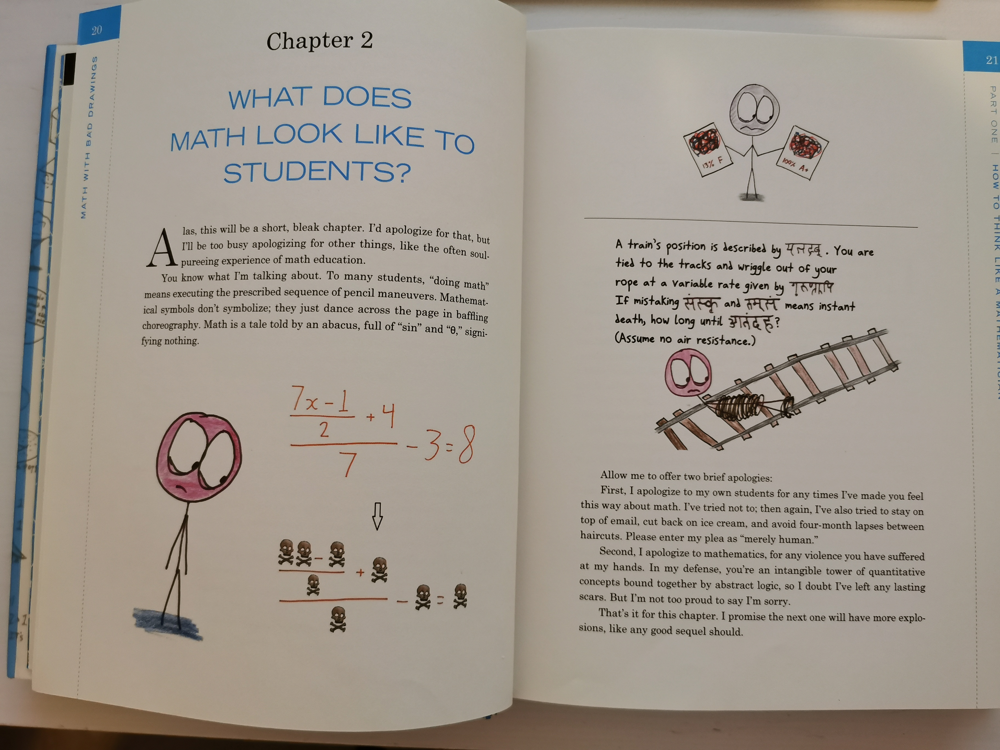
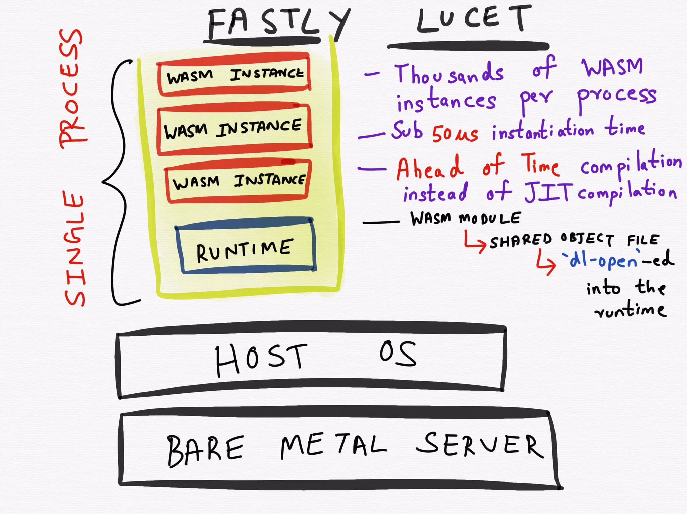

# 新年快乐！

一晃 2020 年快过完 1/12 了。你的新年计划是否也如期进行了 1/12？过去的这一个月来让人心里堵得慌，先后几起伤医案，令人发指；接着武汉的疫情愈演愈烈，令人揪心。我好些在北京的朋友，大过年的，有家不能回，只能在遥祝家里的亲人；在武汉的朋友，反倒豁达，终于可以清净一下，不用走亲访友的，做个快乐的死肥宅。我跟朋友聊起来，都觉得相对于疫情的可怕，人心的崩溃才是最大的风险。我想起有次送我父亲去机场，后来得知他的航班要延误大半天，我在微信里急得团团转，他却优哉游哉地在航站楼里刷步，还跟家人说：好久没锻炼了，正好趁这个机会锻炼锻炼。我没记错的话，那天他走了两万多步。很多时候，信息本身并不重要，重要的是我们怎么去解读。疫情这事，对每个人，每个公司（尤其是还在生死线挣扎的创业公司），每个行业都会有不同的影响。与其焦虑，我们不如去想：事已至此，我们如何让它带来的影响朝着好的方向发展？或者，最坏的预期是什么？我们如果不能扭转局势，如何让结果比最坏的预期要好？

好。闲话不多说。今天的文章除了给大家拜年，还想顺带帮忙参与梳理一个大家年年都要遇到的春节难题：大长假该怎么度过我才不后悔？

## 读书篇

首先隆重推荐的是微信读书里的《几何原本》。这本书我看了一阵子了，在 travis build 的漫长等待里，它陪着我度过那些几乎凝滞的时光。我读《几何原本》起初完全是为了应付越来越难缠的娃儿的几何教学；没想到读着读着读进去了。古典几何学的大厦在欧几里得的妙笔下通过五条公理一点点建立起来，实在令人叹为观止（我初中数学为什么就没有这种感觉呢，反而是觉得几何真是无趣，就是在不断背定理，证明定理）。现在很多人言必称「第一性原理」，如获至宝，却不知第一性原理的精髓在《几何原本》里体现得淋漓尽致。

为啥读微信读书里的《原本》？因为《原本》这样的大部头，也就是零散时间翻翻，休养一下脑子，它每个命题自成一节，两三分钟看完，几分钟十几分钟证明，正好赶上一次 travis build 结束。用微信 mac 端打开微信读书公众号，在网页里看，方便地很。

另外推荐的一本数学书是 "Math with Bad Drawings"。这本书不知道国内有没有，有的话可以看看，美国的读者可以在图书馆借到，还挺抢手。去年年底，我借到了，读完前两章，到期发现已经被别人 hold 无法续借，赶紧 hold，再拿到手已经是年三十了。这本书是这个风格：

我喜欢它的一大原因是里面提出来的问题都很有趣又很有挑战性。比如开篇的 tic-tac-toe 游戏，九宫格的每一格又是一个九宫格，每个九宫格是一个 tic-tac-toe，你要赢得局部的战争，才有机会赢得全局的战争；但过分着眼于局部，又会丢失全局。

这本书适合有大片时间慢慢读，旁边备好 A4 纸。里面的很多问题很烧脑，要好好琢磨一番。我也在学习作者的写作方式和技巧，希望能够领会如何把一本枯燥的数学书写得精彩。

最后一本是鼎鼎大名的 "Algorithms to Live By"，我是一年前买的，有一搭没一搭地看，还没有看完。国内翻译版本叫《算法之美》。这本书的美妙之处是把计算机的算法和生活结合起来，引导我们在生活中选择更好的策略，做出明智的选择。大家都熟知的 LRU 算法，是缓存策略大部分情况下最佳的选择，而生活中整理衣柜，处理桌上的文件，要「断离舍」扔掉不用的东西，都可以用这个策略。

## 编程篇

不想读书，或者读过上述推荐书籍的孩纸，可以花点时间来玩玩编程打怪升级的游戏。

游戏一：学习 rust。

游戏二：用 rust 开发 webassembly 程序。

上述两个「游戏」是不是目标感不足，难以推动真实有效的学习？那么请听题：

游戏一：用 rust 实现 base32 和 base58 的编码。看看两者的性能差异。提示：base32 正向编码可以通过查表，逆向编码如何设计，也可以通过查表完成？

游戏二：用 rust 实现通过一个用户密码派生出 root ca 的密钥，生成 root ca，然后再派生出 server key，用 root ca 签发 server 的 certificate。整个过程不在磁盘上留下任何密钥的痕迹。benchmark 一下看看性能。注：可能用到的库有：argon2（密码哈希），blake2s / blake3（HMAC），pkcs8（密钥格式），yasna（ASN.1），ring（加密库）等。

游戏三：用 prost / tonic / tokio 重写某个使用 grpc 的微服务。

为啥 rust？这货一不小心连拿了四年 stackoverflow 用户最喜欢的编程语言，你就不想了解一下？新年穿新衣裳，也试试对自己而言的一门新语言嘛。

<!-- split -->

未来几年的软件开发，protable binary（平台无关的受控可执行代码）会越来越重要，而 webassembly 似乎是目前唯一受到几大厂商全力支持的方向。webassembly 的应用场景不仅仅是 web（比如大型游戏的 web 化），更是服务端虚拟化的一个新的，也许是更优的解决方案。Solumon Kykes，Docker 的创始人和 CTO 说：

> If WASM+WASI existed in 2008, we wouldn't have needed to created Docker. That's how important it is. Webassembly on the server is the future of computing. A standardized system interface was the missing link. Let's hope WASI is up to the task!

你看 fastly 的 lucet 把 serverless 的冷启动速度提高到一个什么样的级别（对比：aws lambda 通常 200ms 的启动时间）：

（关于 lucet 和 aws 的 firecracker 的优劣，后续有功夫我再撰文）

随着 5G 时代的到来，高带宽会带来网络边界的模糊：数据变得灵动起来，从而带动计算会时而发生在客户端，时而发生在服务端。当越来越多的计算可以直接发生在客户端时，一个平台无关的，安全的代码运行环境就变得至关重要，这也是 webassembly 的机会。

而 webassebmly 目前支持最好的语言是什么？Rust。所以学习 rust 至少可以带来如下好处：

1. 新的范式（paramdigm）。子曾经曰过：如果一门编程语言没有带给你新的 paradigm，就不一定值得学，就好像学了 .net 再去学 java，或者学了 python 再学 ruby，从拓宽边界的角度，意义不大。
2. 可以编译成 webassembly —— 未来的也许会真正实现「一次编译到处运行」的可执行体：浏览器内，IoT 设备，各种服务器，手机等。
3. 接近于 C/C++ 性能，不输于 ruby / elixir 表现力的语言。

所以，趁着假期没有「你妈逼你结婚了么」这样的烦扰，抄起心爱的 vscode，写代码去。

## 亲子篇

这是写给中老年程序员的。青年程序员朋友可以跳到文末点「在看」了。

昨天晚上忙到快 9 点回到家（这一整天我是 69 式 —— 早六点晚九点），小宝把我拉到三楼，说她是今年家庭春晚的总导演，让我跟她排练一个舞蹈。她给我安排的舞蹈是这样的：先是她独舞半天，然后招呼我上台。我上台扮演一枝荷花 —— 动作倒是简单 —— 左脚挪到右脚前点一下，身子面向斜右方，屁股向后撅着，双手合拢然后展开成荷叶状，放在下巴处（敢情我脑袋是花骨朵？），然后右脚挪到右脚前点一下，身子面向斜右方，双手合拢然后展开成荷叶状，放在下巴处，不断重复。你可以自己试验一下便可知这个动作有多骚气外露。

我按照小宝导演的要求努力把动作做标准。这时候导演发话：爸爸，你要演得卖力一些，像是一朵要吸引我注意力的假荷花。然后我慢慢发现你是假的，我就做出推的动作，你就往前倾，当我做出用力推的动作，你就倒下去，然后滚出舞台。

妈呀，原来我这个假荷花要演一个真的假荷花。。。结局还是正义战胜邪恶，我滚了。

对于中老年程序员来说，假期是个难得的放松机会，平日里 996 劳心劳力的，这时候不敢满世界旅游了，窝在家里既不想读书又不想写代码，正好花些时间，和娃儿们增进感情。搭乐高，读故事书，一起看动画片，抽老牛，甚至，跳皮筋。让紧绷的弦松一下，毕竟，只需要在家受一周的罪，熬过去就可以愉快地滚回办公室 996 式养生了。

嗯，就这么多，大家对于怎么愉快不失优雅不会后悔地​过节心里有谱了么？祝大家新春快乐！平安健康！我们一直在一起，彼此思念。爱你们的程序君。

## 贤者时刻

> 蟋蟀在堂，岁聿其莫。今我不乐，日月其除。无已大康，职思其居。好乐无荒，良士瞿瞿。
>
> 蟋蟀在堂，岁聿其逝。今我不乐，日月其迈。无已大康，职思其外。好乐无荒，良士蹶蹶。
>
> 蟋蟀在堂，役车其休。今我不乐，日月其慆。无已大康，职思其忧。好乐无荒，良士休休。
>
> 诗经 国风
