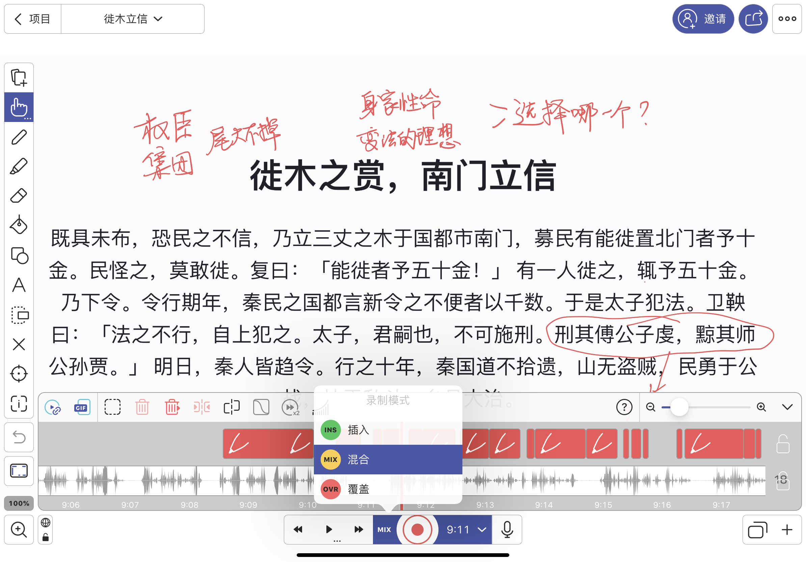

# 如何制作教学视频？看看我的探索之路吧

自从去年 9 月以来，我每天晚上花差不多一个小时给闺女小宝上课。上课的内容很杂，从周一到周日，依次是：历史故事，数学，scratch，科学探索，纪录片，励志电影，以及几何。每每上完课后，我在朋友圈「炫耀」，朋友们都会鼓励我何不干脆把内容做成视频，独乐乐不如众乐乐。后来我做过一些尝试，然而直接录制我跟小宝上课的过程效果不太好，因为一来它太定制化了，二来时间太长，有效信息量不够，除非被逼着，或者闲得无聊，否则不会有人愿意听一个小时左右，没有经过深度加工的，由并不专业的老师讲述的「课程」。我也尝试过把我跟小宝讲的数学课或者科学探索课压缩，去芜存菁，以「李永乐老师」或者「妈咪说」的形式呈现，然而这并不是我擅长的方式，刻意模仿反而失去了我自己讲课的灵魂。

所以录制视频这事，就搁下了。

二月初新冠病毒越来越肆虐，我天天刷着新闻，和全国人民一样，为武汉的遭遇共情，产生了轻微的创伤后应激障碍（PSTD）—— 我「哀其不幸，怒己不争」，时而像个愤青，时而像个傻子，满满负能量。老婆参与了一个西雅图地区的一个慈善组织发起的「与武汉孩子共读英文书」的活动，让小宝能够给她的同龄人贡献一些绵薄之力，便劝我与其这样天天骂这个骂那个，整那些没用的，不如想想自己能干点什么。思来想去，我决定再趟一趟视频教学这条路 —— 能把知识通过不同的维度分享出去，也算是有一点点贡献吧。

在选题上，我从历史故事，数学，scratch，科学探索和几何中，选择了历史故事。这是小宝最喜欢上的课程，和我互动性最强。在过去的四个月的时间里，我已经给她讲完了《资治通鉴》五卷周纪，现在正在讲秦纪，有了之前的铺垫，我讲起来会轻车熟路。更重要的是，历史故事讲起来非常灵活，短短几分钟就可以讲完一个，而且每个独自成篇，别人听起来没有负担。于是我便开始思索如何动手。

首先是听众。按照之前我尝试的经验，给小宝这样的孩子讲的方法不太适合做成视频，或者说，不太适合做成十分钟以内的短视频。即便是大家耳熟能详的三家分晋的故事，给小宝讲，前因后果我就讲了一个多小时。所以我把听众选定在有一定历史基础，想要从《资治通鉴》里获得更多收获的人。

接下来是内容。虽然我去年为了自己阅读方便，把 294 卷，近三百万字的《资治通鉴》，一卷卷切成了 slides，但从讲述的角度来看，还不够好。平时我给小宝讲的时候，都是以故事为维度，一个故事一个故事地讲。所以我进一步把之前加工过的内容，从五卷周纪里，组织出七十多个故事（见：tongjian.qiaopang.com/story-zhou）。这七十多个故事从「智宣子赵简子立储」起，一直到「周赧王债台高筑」，每个都自成一体，方便讲解。在这些故事里，还穿插着《史记》和《左传》等的引用。《通鉴》的内容太过紧凑，有时候往往几个字就牵出一大堆典故，不旁征博引不行。比如司马温公在讲到「诚信」时，简单说了句「昔齐桓公不背曹沫之盟，晋文公不贪伐原之利，魏文侯不弃虞人之期，秦孝公不废徙木之赏」，就整了春秋战国时四个典故。这些都需要加以说明。还有些内容需要糅合起来 —— 比如息壤之盟和益阳之战。甘茂如果不在息壤用「曾子杀人，曾母投杼逾墙」的故事和秦武王盟誓，就没有之后益阳之战的胜利。这样的内容不糅合起来，单独讲会让读者摸不清头脑。

听众和内容定好之后，便是如何做的问题。就好比一个产品，圈好了用户，制定好了策略，接下来见真章的是执行。李永乐老师和妈咪说的讲解方式我并不擅长，于是我便把目光投向了 Khan Academy 的方式。可汗本人在课程视频中并不出现，他通过声音和板书一步步引导，对我而言也许是一个可行的方式。于是我使用 iPad 上的 Notability 进行板书，用 iPad 的屏幕录像进行录制，开始了第一波尝试。

第一批视频做完之后，我拿给老婆听。她听了之后，觉得效果不佳。两个问题：1. 声音太过平淡，听着让人昏昏入睡。2. 节奏有些缓慢，信息密度不够。这两个问题切中要害。对于像我这样没有接受过专业训练的人士来说，给小宝讲课和带着耳机边录边讲完全是两种状态 —— 平日对着小宝那个滔滔不绝口若悬河的我在正式录制内容的时候就像《国王的演讲》里的乔治六世那样，磕磕巴巴，满屏的嗯啊以及口头禅。于是我只好不断地反复重录，有了一个还不错的版本后，再用 iMovie 剪辑，最后配上古筝音乐（高山流水和渔舟唱晚）来掩饰讲解的不自信，以及剪辑后导致的轻微的不流畅感。

第一批七个视频，我花了一整个周末来制作，尝试了 notability 和 paper 两个工具，最后确定使用 notability。录好的视频使用 iMovie 编辑起来非常辛苦，因为我的嗯啊实在太多，不得不细细扣除。有些视频录下来是 7 分钟，扣完中间过渡的留白和嗯啊，就剩下五分种。

第二周周末，我继续用相同的方式制作第二期七个视频。除了对所用工具的熟练，尤其是对 iMovie 快捷键的熟练之外，做视频的能力我并没有太多的长进。7 个视频，大约三十分钟的成品内容，还是要花去我大半个周末 —— 除了我带小宝小贝上舞蹈课的时间外，我都用来闷在书房做视频，一遍遍录制，一点点剪辑，效率之低令人发指。我发现，屏幕录像不是一个好的解决方案。当出现我说错话或者思考时间太长，前后衔接不好种种状况时，我不能把屏幕录像停止下来，只能给自己备注一句：「这段不要」，然后深吸一口气，重复之前讲坏了的内容。被「备注」不要的内容，会在我使用 iMovie 剪辑的时候剪去，同时，有些讲得不够好的地方也会被剪掉，这大大增加了工作量。在「刺客聂政」这篇，我录制了七分钟的内容，最后剪辑出来只有两分多钟。好多内容因为讲得磕巴，太难剪辑，干脆大段删去。因而我边做边找更好的工具。我希望有工具可以允许我像播放幻灯片一样切换我的内容，可以对内容进行批注，并且，还可以在 app 里直接录屏，这样可以随时开始，随时终止 —— 最好呢，还有简单的视频剪辑功能，这样不好的片段，我可以直接删去，省得后来还需要在 iMovie 里二次编辑。

从这个需求出发，我先后尝试过好些个工具。其中的佼佼者是 ShowMe，Educreations，以及 Explain Everything。综合试用下来，我付了一年 $25 的费用，选择了最贵，但最满足我需求的 Explain Everything。

Explain Everything 除了我说的那些功能外，最让我欢喜的是 Mix 模式。这样，我可以把视频的录制分成两个阶段：首先集中精力关注录音本身，把话讲好，然后把声音输入关掉不录，使用 Mix 模式在时间线上再录一遍，边听边剪辑边添加板书。以前的视频，我往往在板书大段内容的时候，需要停下来不说话（还是做不到李永乐老师那样收放自如啊），停止板书后，再解释文字。这样，iMovie 剪辑起来很辛苦，一段视频，到处都有这样需要被剪掉的留白。而 Explain Everything 完美解决了这个问题 —— 这也是它的主要特色。

等我用得更加熟练之后，我可以做一期 Explain Everything App 的详细介绍。

这个周六我开始大面积使用 Explain Everything，从「人主自臧，则众谋不进」一直到「徙木立信」。这七个视频，我都是用 Explain Everything 完成的。它们前前后后花了我六个小时完成，效率比之前大大提高。这些视频平均 7 分钟左右，即便没有很精细地剪辑，听下来感觉也比之前的效果好不少。我特意做了计时，发现在我自己表现最好的情况下，五分钟的视频需要四十分钟完成 —— 我还需要继续磨练自己的技能。

下面的这个视频「徙木立信」是下周末才会在 youtube 和 bilibili 上跟大家见面的视频，我把它放在这里，供大家品鉴：

视频制作出来，我把他们放在了 bilibili 和 youtube 上。bilibili 的使用体验非常令人惊喜 —— 它提供了上传的模板，可以让我不必每次都设置相同的标题，标签和介绍。这对一次性上传多个视频的 up 主是个福音。youtube 没有模板的功能，上传的过程非常蛋疼。两个应用都支持定时发布，这样我周末一次性做好的内容，就可以在北京时间每天晚上八点发送出来。

在 bilibili 和 youtube 上，我藉藉无名。因而视频观看量少得可怜 —— 不过，这也给了我更多的时间不断试错，不断提升自己制作视频的能力。大家听了上面的「徙木立信」感兴趣的话，可以去 bilibili 搜：「程序君」或者「喜欢历史的程序君」关注；或者，如果你使用 youtube，可以搜：「tyr chen」或者「程序君」找到相关的视频。

希望大家喜欢这样的内容。目前我计划把《周纪》五卷的内容弄完，之后看时间，争取把《秦纪》三卷也弄完（相应的故事已经整理完毕：tongjian.qiaopang.com/story-qin）。再想后续的事情。如果大家对这个系列视频有什么建议，请不吝赐教；有更好的工具，也请跟我分享。谢谢！
