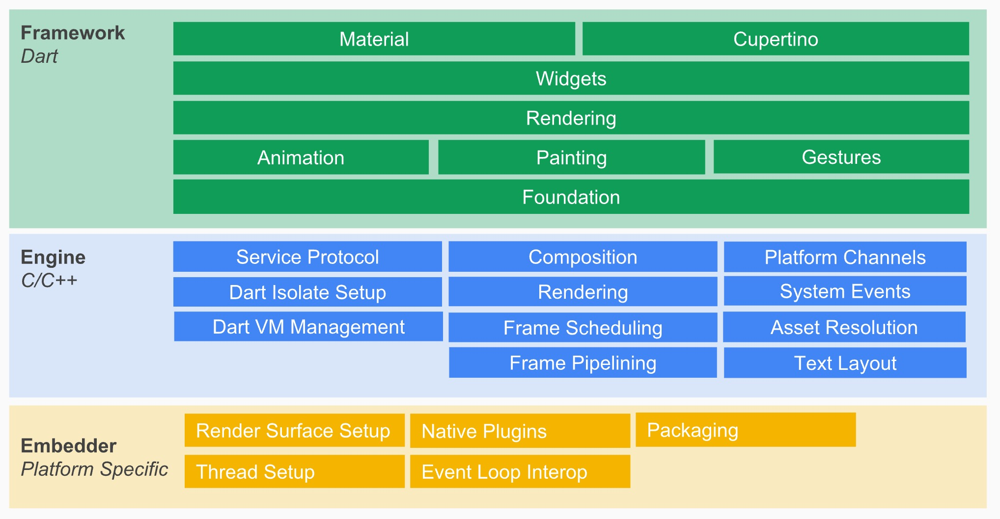
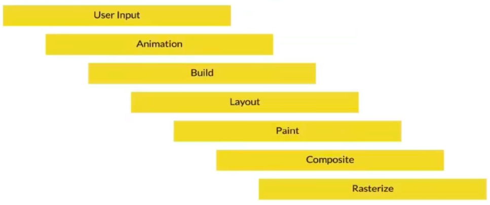

对于一个喜欢追求新技术的人来说，flutter 火爆了一年多我却没有尝鲜，实在是说不过去。我之所以对 flutter 不感冒，源于我对 flutter 所使用的 dart 语言的无知 —— 我觉得既然市面上有 typescript 这样可以满足 flutter 需要的语言，为何要用 dart 这样一个行将就木的语言呢？但最近有个朋友给我展示了他用 flutter 做的一个私人项目，惊艳到我，于是我开始学 flutter。

我学 flutter 的历程和其它语言有些不同 —— 比如学 rust，我直接边看官方文档边写代码，整个过程非常顺畅；而学 flutter，可能是我没有什么移动端开发经验的缘故吧，我读官方文档总有种「从入门到放弃」的感觉，于是我便找了一些视频课程来看。

我先是跟着 youtube 上的 Flutter Crash Course for Beginners 2020[1] 大致过了一遍。这个课程虽然有差不多 6 个小时，但因为是面对没什么编程基础的听众，所以大部分时候可以用 1.5 倍速看。有些非常基础的内容，如介绍 dart 的部分，甚至可以跳过，自己去看 Learn Dart in Y minutes，就足以满足课程的需要。这个课程介绍了一些非常基础的组件，跟着它我最终完成了一个很简陋的 app。

随后，我又在 udacity 上找到了一个叫 Build Native Mobile Apps with Flutter 的免费课程。这个课程深入一些，由 google 的工程师讲解，主要是介绍概念，往往抛出一些知识后就直接让你自己上手。这个课程不太适合初学者，但因为有大量的习题，可以很好地消化和熟练概念。如果你有一些 react 的经验，通过这门课程掌握 flutter 的基础知识很不错。整个课程因为有大量的练习，所以整体所花的时间大概在 8-12 小时。

有了这两个课程垫底，又读了 flutter gallery 的部分源码，花了些时间深入学习 dart，我对 flutter 算是有了一些基本的了解，下面就谈谈我个人对 flutter 的感悟。

## flutter 好在哪里？

和其它跨平台移动应用解决方案不同，flutter 更像是一个游戏引擎，而 flutter 应用是一个披着普通应用外衣的游戏。你可以停下来仔细想想这意味着什么。是的，flutter 构建在一个 2D 图形引擎 Skia 之上。可能很少有人听过 Skia，它是 google 2005 年收购的一家图形引擎公司，由 Michael Reed 创建。有趣的是，05 年 google 还收购了 android。Michael Reed 此人非常低调，我想找和他有关的更多信息却无从下手，这哥们连 LinkedIn 页面都懒得建立。唯一和他有关的消息来自于一篇 2017 年的 techwire 报道："Inside Google's Chapel Hill outpost"，里面提到这哥们依旧在 Google，领导着 Chapel Hill 的四十来个员工。skia 性能非常优秀，在 google 的不断打磨下，后来逐渐成为 chrome 和 android 内置的图形引擎，为两者的成功奠定了坚实的基础。

我们知道，flutter 之前的跨平台移动应用解决方案，有两大主流思路：

1) 利用 DOM 来渲染 UI。这是早期的 Phone Gap，如今的 ionic 的路线。它让开发者可以撰写 javascript，然后将其打包到一个移动应用中。移动应用本身只是一个壳子，所有的逻辑还在 webview 的 javascript 中。这样的应用虽然能很好地跨平台，通过合适的 UI 库可以比较细腻地模仿原生应用的样子，但它的阿喀琉斯之踵是性能，包括渲染的性能。

2) 把 javascript 映射到原生 UI，使用原生 UI 的能力。这是 react native / weex 采用的路线。Phone Gap 让人诟病的渲染性能让开发者思考一个问题：如果 DOM 渲染效率太低，那么可不可以通过构建合适的 UI 库，让 javascript 代码可以一对一映射到原生 UI 上，从而达到和原生应用几乎一样的渲染性能？于是 react native 尝试了这条路径，让整个用户体验几乎和原生应用一样，大大超越了 DOM 渲染的体验。然而，这种方法的缺点是业务逻辑和 UI 之间还是通过 js bridge 完成，所以这依旧会拖累一些性能。另外，如果有奇奇怪怪的 UI 需求，可能还是需要撰写对应的原生代码。

### flutter 有自己的渲染引擎

flutter 走了一条截然不同的，很有想象力的道路：不依赖已有的渲染引擎，自己控制屏幕上的每一个像素的渲染。这就是为什么我说 flutter 更像是一个游戏引擎：因为屏幕上显示的每个控件，实际上都是 flutter 自己一个像素一个像素画出来的，于是，任何改变都在重绘整个屏幕 —— 当然，flutter 会优化重绘的过程。这就是为什么 flutter 会宣称自己的渲染能力是 60 fps —— 这足以流畅地运行游戏。有了这个概念，我们会更容易理解下图：

图中的 C / C++ Engine 部分，包含了 skia 和 dart VM。用户撰写的 flutter 代码，连同 flutter framework 一起，最终调用 skia 库通过 GPU 来高效地渲染图像和文字。我们知道，自己在底层控制渲染虽然极其高效，但代码的开发效率很低，所以 flutter 撰写了大量的 SDK 代码来让用户的 flutter 代码简单明了。

如果你写过一点 flutter 代码，你会感觉和 react 似曾相识。的确如此，flutter 借鉴了 react 大量工程实践的经验，其生命周期，状态管理和 react/redux 非常类似。比如说 flutter 把控件分成 stateful 和 stateless，stateful 控件里通过 `setState` 来控制整个 UI 的「随需而变」（reactivity）。在 react 里，大家都熟悉 Virtual DOM 的概念，渲染时，通过 diff VDOM 和 DOM 的差异，把真正改变的部分渲染到 DOM 上；而 flutter 也有类似的思想，它在内存中保留组件树（widget tree），在渲染时看哪些子树改变了，然后进行重新渲染，这个算法叫：structural repainting using compositing，感兴趣的同学可以看 flutter's rendering pipeline [2]。

在 flutter 里，从用户输入到最终渲染，会经历以下 pipeline：

所以你看 flutter 每个控件都有一个 `build` 方法，用来控制该控件的渲染。和 react 的 `render` 类似，build 方法里不要放任何计算密集型的代码。

flutter 自己控制渲染的特点，给它带来了很多革命性的优势 —— 这是对 react native / weex 的降维打击。比如说：flutter 很容易创造出来非常酷炫的动画和界面 —— 任何不那么规则的，定制型高界面，在其他框架，甚至是原生应用看来都是很费劲的工作，通过 flutter 往往简单很多。比如下图：

另外，相对于 react native / weex 甚至是原生应用，flutter 很容易保持不同操作系统和硬件的 UI 一致性，这个能力往往被很多人忽略。比如，当你开发一款原生应用的时候，你需要考虑该应用对旧的操作系统和旧的硬件的兼容性。而 flutter 自己处理渲染，于是不同版本的系统下，其表现力是一致的，这大大减轻了测试的工作。

### flutter 跨平台的潜力无穷

flutter 有着无与伦比的跨平台潜力。同样的，这得益于它自己控制屏幕的渲染。只要在组件层面使用得当，处理好 media query，flutter 很容易让你将移动端应用扩展到客户端，甚至 web。目前，flutter 已经能够很好地支持 osx 应用（master channel），而 windows/linux 应用目前是有限支持（technical preview）。此外，在 flutter beta channel 里，也有 web 支持。目前 flutter 是最有希望统一大前端的技术方案，我想，flutter 在大前端这个方向有非常大的野心的。

<!-- split -->

## 为什么 flutter 使用 dart？

一个人使用什么样的语言会影响到他如何思考，尤其是在程序员的世界中。据说 flutter 的团队尝试了十多种语言，最后选择了自家的 dart。这个选择一开始会把很多人拒之门外，包括我在内。以前我非常不理解为什么 flutter 不用 TypeScript，而选择 google 自家的，几乎没人使用的 dart 语言，但随着我对 flutter 的了解，我意识到是 dart 成就了 flutter，最终 flutter 反哺了 dart。

我们前面说，flutter 作为跨平台解决方案的最主要的优势就是性能。而 dart 是一个编译型语言，支持 AOT（Ahead Of Time）和 JIT（Just In Time），也就是说，我们所写的 flutter 代码是编译成原生的 ARM（mobile）/x86（desktop）机器码，这样最大程度提升了运行时效率。因为 dart 是一个带 GC 的编程语言，所以它的 AOT 编译和 golang 相似，会在编译好的执行文件中加入 VM 里关于内存管理的运行时，这也是为什么在上面的架构图中，会有 dart 运行时存在。而 dart 的 JIT 能力则非常方便开发环境下的调试，这对移动端开发者来说，几乎是 web 开发的那种「边写边调」的极致体验。这是很多已有的语言不具备的能力：TypeScript 这样的解释型语言有 JIT，但没有 AOT，flutter 团队还得为其提供 AOT 编译的能力，考虑到 ARM/x86 的支持和性能优化，这会是一个浩大的工程；而 golang/rust 这样的编译型语言有 AOT，但没有 JIT，且语言本身的表现能力不太适合写前端代码。

在 android 上工作的同学应该会有这样的体验：早期的 android 版本如果不合理控制对象的分配，会导致时不时出现卡顿的情况，这是 GC 控制的内存分配的弊病：虽然省去了手工分配和释放内存的麻烦和不安全，定期的 GC 会影响应用的性能。虽然这种现象在较新的 android 上越来越少见，但仍然是个问题。对于 dart，android 工程师可能会有这样的疑问：dart 的 GC 能够承载大量的 UI 组件的复杂交互么？

既然 flutter 敢于拍胸脯声称自己的渲染能力是 60fps，那一定是 dart 创建 object 和 GC 的开销足够低。对此我没有专门研究过，但从一些公开的博客上（比如 Flutter: don't fear the garbage collector），可以看到 dart 在创建 object 和 GC 时都不需要加锁（mark 时需要加锁），它的 GC 是分代收集的（generation collection），吸取了 java GC 的很多经验教训（相信也吸取了同在 google 的 golang 的经验）。对于 flutter 的应用场景，大量的 object 生命周期都很短，适用于 young generational hypothesis，所以 GC 的效率足够高。

以上说的都是性能上的取舍。一门编程语言的语法和编程范式往往会影响到使用者的效率，从而影响语言的可接受度。dart 对于有 java/typescript 背景的程序员来说很容易理解，尤其是只考虑写 UI 的话，几分钟到几个小时就能上手，非常简单。而它的语法，相对于 java 来说，也很适合冗长的 UI 结构的声明。

作为一门面向对象的语言，dart 支持 mixin，泛型等高阶功能。dart 采用了 async/await 的并发模型，每个 future 对象可以看做是一个独立的 coroutine。dart 虽然是静态类型，但它的类型模式和 TypeScript 很类似，类型声明虽然推荐但不强制。这几天使用下来，觉得 dart 做服务端开发似乎也不错，至少语言的表达能力要比 nodejs 背后的 javascript 强。当然，目前使用 dart 的程序员几乎都是 flutter 程序员，但不排除未来会有类似 javascript -> nodejs 这样的前端逆袭后端的事情发生。毕竟，后端程序员的能力不断地被云服务商压扁，一个后台工程师辛辛苦苦攒的服务端代码，分分钟被 firebase 这样的怪兽逆袭。

## 结论

flutter 是一门非常有意思，值得投入一些精力的框架。如果你正在做大前端相关的事情，那么，不该错过 flutter；如果你在做后端开发，也可以了解一下 flutter，构建自己端到端的能力。

## 文献来源

1. flutter: https://flutter.dev
2. dart: https://dart.dev
3. Flutter Crash Course for Beginners 2020: https://www.youtube.com/watch?v=x0uinJvhNxI
4. Build Native Mobile Apps with Flutter: https://www.udacity.com/course/build-native-mobile-apps-with-flutter--ud905
5. Inside Google's Chapel Hill outpost: https://www.wraltechwire.com/2017/05/24/inside-googles-chapel-hill-outpost-a-growing-success-story
6. flutter's rendering pipeline: https://www.youtube.com/watch?v=UUfXWzp0-DU
7. Implementing complex UI with flutter: https://www.youtube.com/watch?v=FCyoHclCqc8d
8. SY expedition travel challenge: https://github.com/MarcinusX/sy_expedition_travel_challenge
9. Flutter: Don’t Fear the Garbage Collector：https://medium.com/flutter/flutter-dont-fear-the-garbage-collector-d69b3ff1ca30