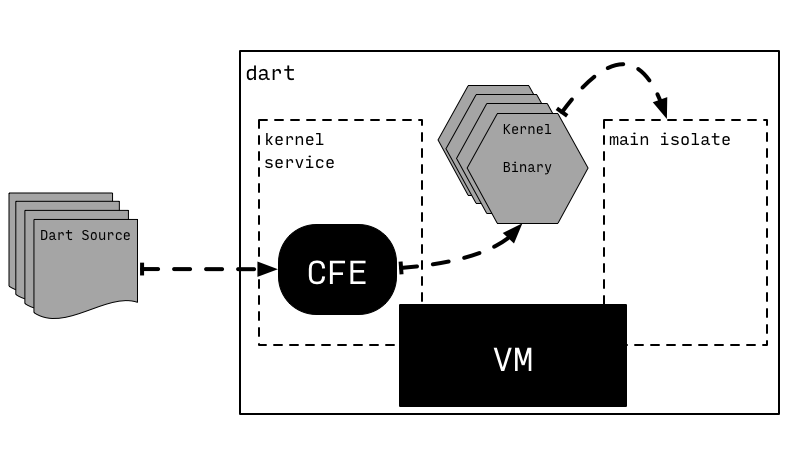

# dart：失之东隅收之桑榆

一个月前，如果我要为自己最看不上的三个半语言排个名，dart 恐怕会位列其中。dart 是 google 在 2011 年就推出的编程语言，目标是成为一个结构化的 web 编程语言，暗藏着取代人们天天用又天天骂的 javascript 的野心。记得大约 2014 年前后，我在 youtube 上看了 goto conference 的一个关于 dart 语言的 keynote[1]，于是就对 dart 有些关注了。当时我的感觉是：这特么又一个「编译成 javascript」的语言 —— 天知道我们需要多少这样的语言。2014 年前后的前端生态还没有今天这么百花齐放 —— 如今一个编程语言没有对应的「编译成 javascript」的方案，就像没化妆的女孩儿，都不好意思出门。那个时代 TypeScript 还没有什么人用，「编译成 javascript」语言里最火的是 CoffeeScript，以及叫好不叫座的 Elm。当然，google 推出 dart 更多的是从工程实践上的考量：在此之前，google 已经从其 GWT（Google Web Toolkit）和 Closure compier（用于优化 js，清除死代码）中得到了一个宝贵的经验：如果有静态类型系统，javascript 的性能优化和大项目工程化可以大大提升一个台阶。

看了这个 keynote 后，我简单尝试了一下 dart，觉得语言中规中矩，没有什么特点，唯一让人印象深刻的反而是 keynote 里那句：__In dart, you are innocent until proven guilty__。

后来，dart 语言逐渐成熟，一度有可能成为当时如日中天的 chrome 内置的第二种 web 语言，善于煽风点火的媒体甚至将其称为 javascript killer。为了试探市场的反应，google 发布了 dartium 项目，一个包含了 dart VM 的 chrome 版本。后来不知为何，2015 年 chrome 团队最终决定不会在 chrome 里内置对 dart 语言的支持[2]，于是尚在襁褓中的 dartium 无疾而终，而 dart 聚集的人气很快消散。随后的几年间，除了 google 团队内部还在坚持使用 dart 来做自己的前端应用，业界对 dart 的使用少得可怜。与此同时，作为 javascript 超集的 TypeScript 因为其对 javascript 生态系统的友好和强大灵活的类型系统得以不断积聚人气，渐渐成为 javascript 生态圈里大家首选的「编译成 javascript」的语言。一退一进之间，前端圈似乎在宣布着 dart 的死刑。

然而，这个世界是奇妙的，往往在山穷水尽无路可走的时候，就暗自蕴含了转机。dart 没有像它的创建者们设想的那样，成为屠龙的战士；但它的诸多设计却不经意间成为了后来 flutter 选择 dart 的决定因素。乔帮主说：

> You can't connect the dots looking forward; you can only connect them looking backwards. So you have to trust that the dots will somehow connect in your future.

这一切真的是冥冥中自有天意。

我们对比 dart 和 TypeScript，看看两者的共同点：

1. 都以前端开发为语言的主要设计目标。
2. 都觉得 javascript 不够理想，希望通过一门新语言来解决 javascript 的诸多问题。
3. 都倾向于一个强大的类型系统有助于构建安全的，复杂的前端项目。
4. 都意识到类型系统应该帮助开发者而不是成为开发者的阻碍（you are innocent until proven guilty）。
5. 都把自己打造成一门面向对象的语言，包括静态类型系统，接口，抽象类，泛型，mixin 等。

在这样相同的思路之下，dart 和 TypeScript 开始分道扬镳：

1. dart 从头创造一门新的语言，而 TypeScript 尝试成为 javascript 的一个超集。
2. dart 放弃了 javascript 的庞大生态圈，而 TypeScript 则拥抱现有的生态。
3. dart 更倾向于用来构建 UI，而 TypeScript 更倾向于用来构建大型应用。
4. dart 支持 JIT 和 AOT 编译，其 AOT 编译的目标可以是机器码或者 javascript；而 TypeScript 只能编译成 javascript。
5. dart 也许未来可以支持 webassembly（类似 golang，有没有意义再说）；而 TypeScript 没有这种可能。

从取代 javascript 的角度看，TypeScript 做对了几乎所有的事，而 dart 第一步就走错了。从头创建一门语言，罔顾 javascript 庞大而富有活力的生态圈，这是「破而后立」，是「舍得」，需要梁静茹给的勇气。大部分时候，「破」的豪赌意味着「输」，而不是「立」；而「舍」并不意味着「得」。dart 幸运地坚持到了 flutter 出现的那一刻，应了那句：「谁无暴风劲雨时，守得云开见月明」。

## 开发者体验和运行时效率

在没有太多接触 dart 的时候，我想当然以「既生瑜何生亮」为由不喜欢这门语言。因为尝试 flutter 而「不得不」使用 dart 后，我开始慢慢欣赏这门语言。dart 和我之前使用过的很多语言都不太一样：有些语言顾及到开发时效率，如 python/javascript/elixir，却付出了运行时效率作为代价；有些语言顾及到了运行时效率，却让开发效率受到损伤，如 c/golang/rust。在我们平时的观念里，开发效率和运行时效率，就像鱼和熊掌，二者不可兼得。而 dart 是少见地想把两者都占全了[3]。

今年的一二月份，我花了不少业余时间研究 rust。rust 是那种你一旦入门会爱不释手的语言，但是，开发 rust 程序的过程非常让人崩溃 —— 我并非指和编译器搏斗的过程 —— 而是等待编译的过程。可能是我用了太多 build 脚本的缘故（我的代码里使用了 gRPC），几千行的代码，增量编译，往往要几十秒钟。这是极其糟糕的体验 —— 更长的编译时间意味着更长的反馈链。有人可能很牵强地反驳说，即时反馈会让开发者养成不仔细构思就开始写代码，边写边调的坏毛病 —— 但你还是不得不承认即时反馈是开发效率上的革命。

和 rust 相反，dart 是一门开发时非常高效，性能也不赖的语言。当我们讲一门语言的性能时，我们往往谈及的是：

1. 更小的代码体积
2. 更快的启动时间
3. 更高的吞吐量
4. 更低的延迟

这些要素在开发时和运行时的要求是不一样的，而我们往往只考虑了运行时的需求而忽视了开发时的需求：

1. 更小的代码体积：对于开发时而言，代码体积并不重要。
2. 更快的启动时间：对于开发时而言，启动时间很重要，尤其是重新加载所花费的启动时间，以及恢复到上一次运行状态的时间。
3. 更高的吞吐量：对于开发时而言，吞吐量也不重要。
4. 更低的延迟：对于开发时而言，程序在修改之后，到改动得以体现之间的延时更为重要。

dart 为两种截然不同的需求提供了截然不同的解决方案：

1. 开发时：JIT 编译器，如 dart VM，dartdevc。
2. 运行时：AOT 编译器，如 dart2native，dart2js。

JIT 编译器的目的很单纯，把你刚刚撰写的代码尽快编译成目标平台的代码。因为要快，所以它会牺牲很多解析，分析和优化的步骤，对于开发者来说，JIT 可以带来更低的开发延迟，而对于用户来说，JIT 没有太多好处，效率不高，冷启动速度还慢，对用户不太友好。而 AOT 编译器则要把编译原理课程里的所有步骤都走一遍，甚至有些步骤要来回走很多遍（比如 rust）。这对用户非常友好，大大提升了冷启动的速度，运行效率更高，然而 AOT 对开发者很不友好 —— 看看下图额外的启动时间和运行时间：

比如同样是「编译成 javascript」，在开发时 dartdevc 会把每个 dart 文件单独翻译成 javascript，这样代码体积很大，且不够优化；而运行时 dart2js 会把当前项目的所有依赖一起编译，做 tree shaking，并且根据调用树优化生成的代码。最终，发布给用户的代码体积非常精简，代码的执行效率也是最好的。

如此一来，从产品的角度来看，开发者和开发者的用户的利益都兼顾到了，用户体验非常美妙，可是 dart 团队需要做的工作就多了很多。一个新的语言特性需要被添加到不同的编译器之中，需要考虑不同的场景下的优化方法。随着 dart 对原生平台的支持力度越来越大，支持的平台越来越多，这样的工作会越来越繁琐。我想，这也是大部分语言只照顾一头的原因。

## 语言特性

大部分时候，flutter 中使用到的 dart 都是在画 UI，而这部分的语法，有编程基础的人看着例子十分钟内都能上手。但既然因为尝试 flutter 而使用 dart，那么 dart 的语言特性还是需要大致了解一下的。

dart 面向对象的特性没有太多可说的，如果你有 java/C# 背景，里面的接口，泛型和类型系统都不难理解，大家基本大同小异。如果你来自前端世界，有 kotlin / swift 背景，或者出道于后端，是 rust / scala / haskell 的拥趸，那你大概率会对 dart 的类型系统有些失望，因为 dart 在语言层面没有完整支持 ADT（algebra data types），只有 product type（class），却没有 sum type（tagged union），使得你不太容易优雅地表述复杂的，带有「或」关系的数据结构。而模式匹配，因为它往往和 sum type 是孪生兄弟，在 dart 里也没有支持。

dart 的并发模型非常讨喜，至少，对我的胃口。它受 erlang 的影响不小，提供了类似于 erlang process 的 isolate。在 dart 里，每个 isolate 都有自己的栈和堆，isolate 之间 "share nothing"，只能通过发送和接收消息来传递数据。每个 isolate 自己单独做 GC，这和 erlang 的 GC 也非常类似，因而内存的分配和回收无需加锁，很大程度上避免了 Java 的 STW 问题。dart 里 isolate 之间的通讯见下图，熟悉 erlang VM 的小伙伴估计都会会心一笑：

isolate 可以通过 `Isolate.spawn` 创建，之后可以通过 `isolate.kill()` 结束生命周期。每个 isolate 都有一个 receiving port，类似于 erlang process 的 mailbox，可以用来接收消息。和 erlang 不同的是，dart 的 isolate 没有类似 link 和 monitor 的机制来监控 isolate 的状态。目前我还没太搞明白如果两个 isolate 在通信，其中一个挂掉了，另外一个如何得到通知（可能通过 ping？）。

dart 每个 isolate 内部，运行一个 event loop，处理这个 isolate 上的事件。和 javascript 一样，dart 里的每个异步事件都是一个 future 对象，语言本身提供 async/await 作为语法糖。在 web 环境下，isolate 会被 web worker 执行；而在原生环境下，isolate 可能会被某个线程调用，但要注意的是：同一个线程不能在同一时间处理两个不同的 isolate。

dart 还有一个有意思的特性是 snapshot。顾名思义，snapshot 允许 dart 保存并序列化当前 VM 的上下文，下次可以从 snapshot 中恢复运行。snapshot 目前主要用作加快 dart 应用的启动，但也许未来可以用于很多有意思的场合：比如 bug 的复现 —— 复杂的 bug 可以通过保存 snapshot 给程序员轻松复现。

## 运行时

在开发环境下，dart 运行时包括公共前端（Common Front-End，CFE）和 VM。dart CFE 提供了代码编译服务（compiler）以及代码分析服务（analyzer），其中，代码分析服务是提供给 vscode / android studio 这样的代码编辑器的。dart 的代码分析服务做得相当出色，无论是类型推导，还是自动补全，还是代码跳转，相对于我比较常用的语言 elixir 和 rust 来说，反应速度都是一流，从不卡顿。这使得我在 vscode 里撰写 dart 代码的体验非常舒服。尤其是 dart 2.5 以后，其 CFE 的代码分析服务还内置了 tensorflow lite，用于基于机器学习的代码自动补全。这是一个从用户需求考虑产品的极致的杀手级功能 —— 我想不出还有什么编程语言的前端会如此照顾用户体验 —— 可以肯定的是未来会有更多的编程语言在这一块上迅速跟进。我相信，随着大家在各种语言的 CFE 上的机器学习能力的投入，以后我们写代码会越来越轻松。

在运行 dart 代码时，dart 源码经过 CFE 被翻译成 kernel binary，交给 VM 执行：

这个过程几乎所有的 JIT 语言都有类似的处理方式。

然而 ——

dart 还有另一种玩法，就是我们运行 flutter 在设备模拟器上运行代码的方式：

乍一看，android / ios 不也是类似的方式和模拟器交互么：在用户的操作系统上交叉编译出目标系统上的代码，将其同步到目标系统上运行。但 dart JIT 的方便之处在此显现：第一次完整编译之后，代码的改动都只需要编译和传送修改的部分，VM 负责在目标系统上更新修改的代码。于是，程序可以在维持已有的状态的情况下，得到更新 —— 这就是 flutter 引以为傲的杀手锏：hot reload。看得出，dart 深度借鉴了 erlang 的 code server 的 hot reload 特性，并且将 hot reload 的能力在客户端开发上淋漓尽致地表现出来。

## 服务端支持

没错，dart 是一门前端语言，其很多语法特性也是为了前端而生，比如 ui as code：

但 dart AOT 编译的特性，使得它也有很大的开发后端的潜力。不像 javascript，其运行时被限制在单进程，在 dart 里，通过使用 isolate 可以安全地进行高并发的操作，我们上文中讲过，这得益于其类似 erlang 的 actor model。从这个角度来看，dart 也足以碾压受困于 GIL（Global Interpreter Lock） 的 python 和 ruby。如今，已经涌现出来一些 dart 撰写的 API 框架，比如 aqueduct[6]（如下图），angel[7] 等。

此外，dart 对 http2 和 gRPC 都有 Google 的原生支持（不管嫡庶，毕竟亲儿子），这使得 dart 比较容易撰写高性能的 gRPC 服务。dart 有比较成熟的 FFI 支持，这使得它可以很方便地和 C/C++/rust 交互，扩展其功能。

​Dart 在前端渲染上的努力，比如对 SIMD 的支持，对 GPU 的支持，还使得它在高性能计算上也有很大的潜力。

在服务端开发的整个生态圈来看，dart 还是一个嗷嗷待哺的婴儿。但从语言的角度看，它有足够的潜力，就看往哪个方向继续发展。

从性能上来说，dart 虽然很难和 C/C++/rust 媲美，但它的上限可以接近甚至达到 google 嫡长子 golang 的高度。具体接近到什么程度，要看 google 把 flutter/dart 放在一个什么样的战略位置。

## 结论

这一周在 flutter 上的实验，让我对 dart 的好感度提升了很多。尽管 dart 有这样那样的不足，但不得不说，它具有独特的魅力。有时候我们真的要承认每个人都有「未知的无知」—— you don't know what you don't know。编程语言和人很类似，在没有把它放在合适的位置之前，就像庄子说的「不龟手之药」一样，看上去是那么的无用。所以我们常常感慨：__千里马常有，而伯乐不常有__。感谢 flutter，让我有机会粗浅地研究 dart，从而弥补了一些我认知上的盲区；也感谢 flutter，让 dart 虽然没有机会打败 javascript 成为世人瞩目的哈利波特，但，__在战火中幸存下来并积蓄力量的它，终于长成了那个拿着格兰芬多宝剑怒斩纳吉尼的 —— 纳威·隆巴顿。__

## 参考文献

1. Dart: A Language For Structured Web Programming: https://www.youtube.com/watch?v=UZOIAz-eR34
2. Google will note integrate its dart programming language into chrome: https://techcrunch.com/2015/03/25/google-will-not-integrate-its-dart-programming-language-into-chrome/
3. Dart: Productive, Fast, Multi-Platform - Pick 3: https://www.youtube.com/watch?v=J5DQRPRBiFI
4. Introduction to Dart VM: https://mrale.ph/dartvm/
5. Announcing Dart 2.5: Super-charged development: https://medium.com/dartlang/announcing-dart-2-5-super-charged-development-328822024970
6. Aqueduct framework: https://aqueduct.io/
7. Angel framework: https://angel-dart.dev/
8. How to call a rust function from dart using ffi: https://itnext.io/how-to-call-a-rust-function-from-dart-using-ffi-f48f3ea3af2c
