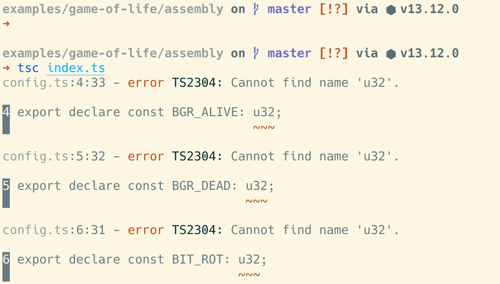
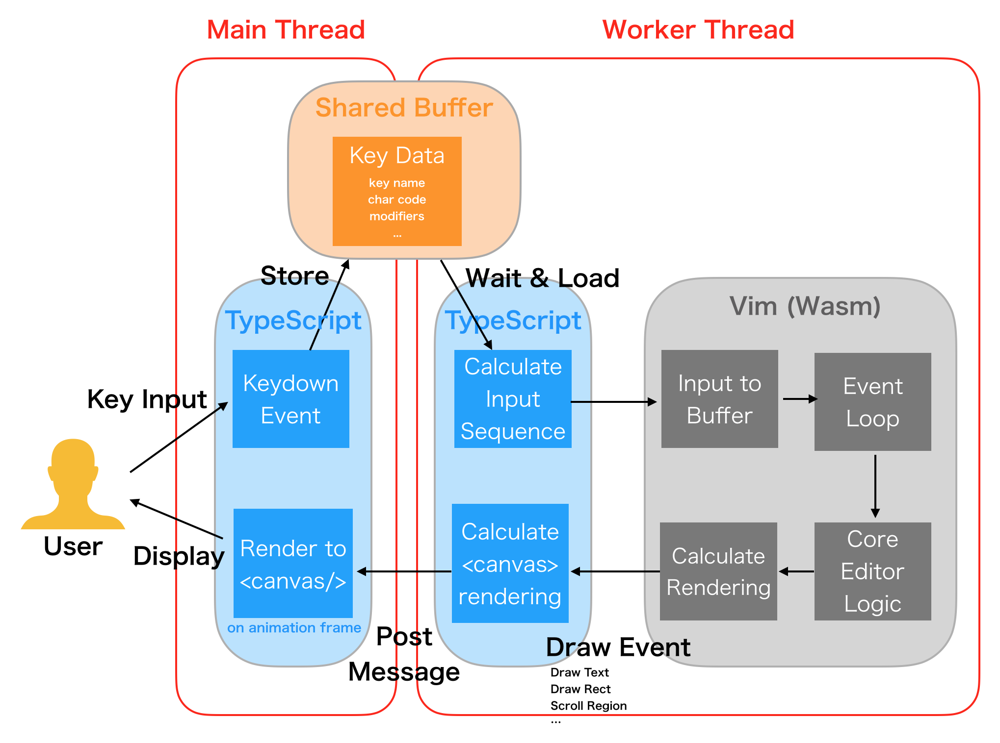
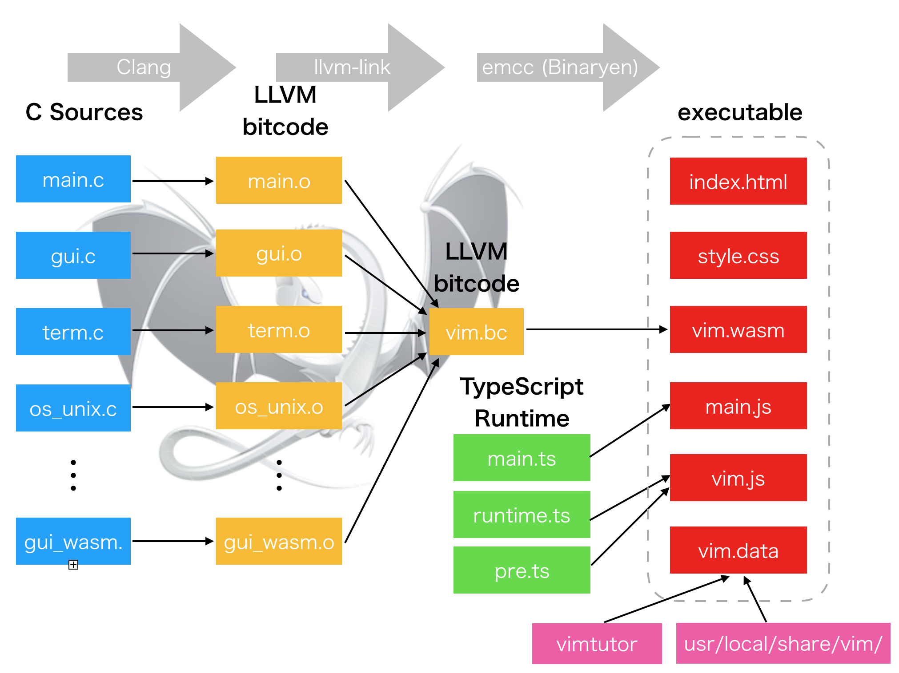
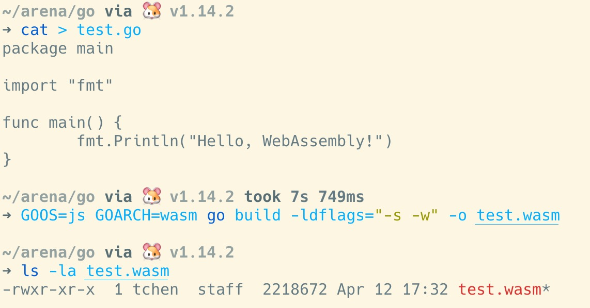
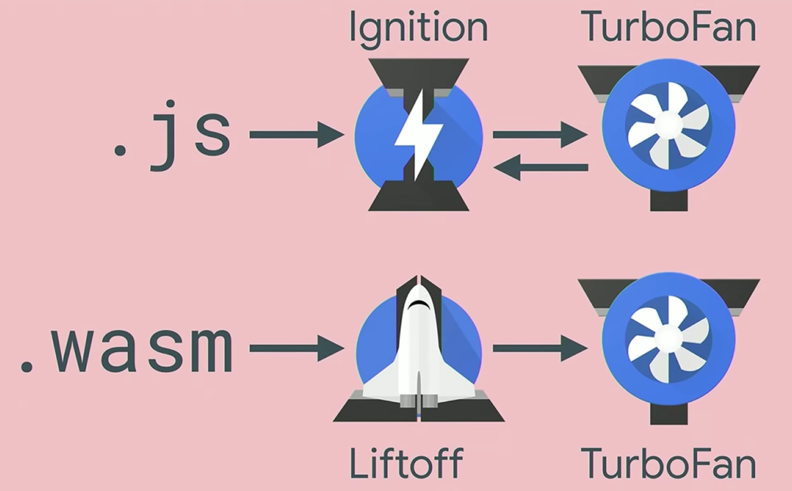

# 为什么有的语言「不能」编译成 WebAssembly？

在上一篇文章「dart：失之东隅收之桑榆」里，我写了这样一句：

> dart 也许未来可以支持 WebAssembly（类似 golang，有没有意义再说）；而 TypeScript 没有这种可能。

于是很多 TypeScript 的拥趸不开心了，为什么说我家宝宝不能支持 WebAssembly（下文称 WASM）？有人找出了证据：看，AssemblyScript[1] 明明就可以支持 TypScript 转换成 WebAssemby 嘛。我不知道说这话的人是否真的看过 AssemblyScript，还是道听途说，仅仅知道有这个么东西，就像北京的的哥那样，说着让人不明觉厉的话。其实只要去 AssemblyScript 的 repo 看一眼，`hub clone assemblyscript/assemblyscript`，随便运行一下里面的例子，你就会发现：

不好意思，走错片场了：

为什么？为什么明明是 TypeScript 代码用 tsc 编译不过？如果你去它的官网 assemblyscript.org 瞅一眼文档，就该明白它们的基础数据类型就有很大的不同 —— 对于数字类型，TypeScript 沿袭了 javascript 的 number，而 AssemblyScript 使用了 i8，u16，f64 等 WASM 的类型。所以我这么回复：

> AssemblyScript 明确说明自己 Definitely not a TypeScript to WebAssembly compiler. 你无法把已有的 TypeScript 直接转换成 WASM. TypeScript 沿用了 javascript 的 internal types（因为最终会编译成 javascript），而 WASM 有 u8, u16, isize 这样的类型。AseemblyScript 只是语法层面基本和 TypeScript 保持一致而已。你在写 TypeScript 的时候需要非常小心，避免使用整个 TypeScript/javascript 的生态圈。还要小心语法上的一些不同，比如 ===，null的检查等。

其实 AssemblyScript 只是一个包装着 TypeScript 语法的新语言而已。那么，为什么 TypeScript 自己直接不能被翻译成 WASM 呢？既然我们为这个话题展开了讨论，我们不妨简单了解一下 WASM，然后问一个更通用的问题：怎么判断某种语言能不能，或者值不值得转换成 WASM 呢？

## 什么是 WASM？它解决什么问题？

WASM 的官网 webassembly.org 是这样定义的[2]：

> WebAssembly (abbreviated Wasm) is a binary instruction format for a stack-based virtual machine. Wasm is designed as a portable target for compilation of high-level languages like C/C++/Rust, enabling deployment on the web for client and server applications.

首先 WASM 是一组指令集格式，这组指令集可以运行在一个特定的基于栈的 VM 上。VM 一般有基于寄存器（erlang）的和基于栈（java）的，WASM 选择了后者，很大一个原因是为了产生更小的程序代码。WASM 的前身是 asm.js，当时 Mozilla 的工程师尝试着把大型的 C/C++ 项目编译成 javascript 的一个隐含类型的，为 JIT 编译器高度优化的子集，结果得到了在浏览器里近乎接近原生应用的效率。之后，Mozilla，Google，Microsoft，Apple 四巨头坐在一起，共同定义和开发了 WASM 技术，并在各自的浏览器中进行支持。2019 年 12 月，WASM 正式被接纳为 W3C 推荐标准[3][4]，成为浏览器中除了 HTML/Javascript/CSS 之后，第四个原生的可执行语言。

WASM 在设计之初就和 javascript 是并行的语言，它的出现不是为了取代 javascript，相反，javascript 还为 WASM 代码的执行起粘合作用。WASM 的强项在于可以将 javascript 生态圈之外的已有代码，尤其是 C/C++，搬运到 web 上，这样能够大大丰富 web 的生态圈，使得原本难以用 javascript 重写的很多系统可以被放在 web 上，比如 vim[5]。

WASM 最早的实现是 Enscripten 编译器，它使用 LLVM，把 C/C++ 代码编译成 WASM，理论上来说，任何使用 LLVM 的编译器都可以使用其支持 WASM。早期的 Rust 通过 Enscripten 支持 WAS，后来提供了自己的 wasm32-unknown-unknown 更好地支持 WASM。Enscripten 除了可以把 C/C++ 代码编译成 WASM 外，它还模拟了 Unix 的运行环境，这让很多的 C/C++ 代码可以者进行少量修改（主要是编译脚本）就可以编译成 WASM。然而，一旦你使用了多线程（WASM 目前还不支持），或者特殊的设备驱动，或者阻塞操作（如 block wait），那么代码需要做不少修改。此外，传统的桌面和命令行软件，其和用户交互的部分也需要修改。下图是 vim.wasm 对 Vim 的交互做的改动：

其整个编译过程如下：

尽管 WASM 已经发展了有五年之多，目前，对 WASM 真正具备完整的，有意义的支持的语言也就是 C/C++/Rust。其它语言的支持要么是残缺的，要么是不可用的。

我们拿 golang 为例。一个基本的 hello world 编译成 WASM 要 2M 多（估计主要是因为 golang 运行时的代码）：

虽然我们可以用很多 hack 把编译结果弄到 1M 多，但这个结果对 web 来说是不可接受的。此外，golang 还没有完全兼容 WASM 1.0 协议，所以不算可用[7]。TinyGo 对 WASM 的支持看上去很有前途，但仅仅因为 TinyGo 不支持 reflection，就自动过滤了 golang 生态圈一大票依赖，比如 protobuf。很多时候，语言的生态本身要比其语法重要得多。语法不难复刻，但生态是需要很长的时间成长起来的。

好在 WASM 目前在飞速发展，有很多功能在讨论和实现之中。比如说：GC 的支持和多线程的支持。有了这两个利器，尤其是 GC 的支持，可以让很多依赖 GC 的语言产生更小的字节码（golang 喜极而泣），这样，WASM 将来可以被更多的语言支持。

有同学拿 awesome-wasm-langs[8] 来反驳我，说：不止 C/C++/Rust，现在已经有几十种语言支持 WASM 了，比如 Python。这个列表的确唬人，但仔细看，比如 pyodide，明明是 python 及其科学计算相关的库被编译成了 WASM 啊？这其实是把用来写 python 解释器的 C 代码编译成 WASM，然后可以执行 Python 代码而已，并不是把 Python 代码编译成 WASM —— 当然如果你非要较真这 TM 就是 Python 支持 WASM 我也无话可说。pyodide 解压下来有 300M，其 WASM 主体也有 13M。这显然不是给正常的 web 使用场景准备的。

我无意贬低 pyodide，这是一个很好的在线运行数据科学家工具集的好工具，就像 unreal 引擎运行在浏览器一样，对特定需求的受众有很强大的吸引力（所以它们不介意加载速度）。但它并不意味着你写一段 hello world，可以通过 pyodide 得到一个能够单独加载的 WASM，这是两回事。如果一门语言对 WASM 的支持是这样子支持，那么的确，在下输了，所有语言都马上能「支持」WASM。

## 为什么 TypeScript 不太可能支持编译成 WASM？

我们回到本文开头的探讨。我很喜欢 TypeScript，它是一门设计得很精妙的语言。但我觉得 TypeScript 不太可能支持编译成 WASM。两个原因：

首先，二者的类型系统有一些鸿沟（前文已经提到了），如果强要把 TypeScript 编译成 WASM，需要 AssemblyScript 这样的语言。然而，这样就意味着整个 TypeScript 和 javascript 的生态圈就很可能无法使用了。而 TypeScript 最大也是最成功的优势就是在为项目渐进式地引入类型系统的同时，保持了对整个生态圈的兼容。如果这个优势不存在，那么使用它的意义何在？

其次，为什么我们要把 TypeScript 编译成 WASM？它能带来什么好处？

更好的性能？如果项目对性能的需求真的变态高，高到是 TypeScript 解决不了的，比如构建一个游戏引擎，那为何不换一种效率更高的语言，比如 rust 撰写，然后编译成 WASM 呢？

更小的代码体积？抱歉，这个 WASM 真的要吼：臣妾做不到啊。

更高效地和 DOM 以及浏览器事件互操作？抱歉，WASM 操作 DOM 需要经过 javascript。。。再看看上图 vim.wasm 是怎么做的。

。。。

如果我们无法回答这个问题，那么花那么大精力支持把 TypeScript 编译成 WASM 有什么意义？仅仅是为了赶时髦搭上新技术的列车么？

我们看 chrome 里对 javascript 和 WASM 的支持：

可以看到，二者是不是取代，而是并存的关系。它们背后使用了同样的执行引擎 TurboFan。javascript 代码在解析和 JIT 阶段会耗费不少时间，但一旦代码在运行时被优化后，其执行效率和 WASM 并没有太大的区别。而对 javascript 这样灵活的语言来说，运行时的优化比 AOT 时期的优化能够做更多的事情。如果强行把它在编译期编译好，反而可能影响运行时的效率。所以，我想不太出来把 TypeScript 编译成 WASM 的在 web 上的使用场景。

当然，WASM 还有一个不容忽视的使用场景是服务器端。它脱胎于 web 的安全性使得它成为后端取代 docker 这样的沙箱的绝好平台。如果 WASI 相关的应用在后端蓬勃发展，那么对于一个 TypeScript 工程师，可以写能够运行在服务器端的 WASM 运行时 wasmer / wasmtime 上，也许还是有些吸引力的。这也许是唯一的，把 TypeScript 编译成 WASM 的理由。

## 参考文献

1. AssemblyScript：https://docs.assemblyscript.org/
2. WebAssembly 官方文档：https://webassembly.org
3. WebAssembly Wikipedia：https://en.wikipedia.org/wiki/WebAssembly
4. WebAssembly Core Specification: https://www.w3.org/TR/wasm-core-1/
5. Vim WASM: https://rhysd.github.io/vim.wasm/
6. Enscripten: https://emscripten.org/
7. Golang: Are we WebAssembly Yet？: https://medium.com/@KevinHoffman/golang-are-we-webassembly-yet-e0a2e180fc98
8. Awesome WASM langs: https://github.com/appcypher/awesome-wasm-langs
9. WebAssembly for Web Developers: https://www.youtube.com/watch?v=njt-Qzw0mVY
10. AssemblyScript is not a subset of TypeScript: https://dev.to/jtenner/AssemblyScript-is-not-a-subset-of-TypeScript-4ka3
