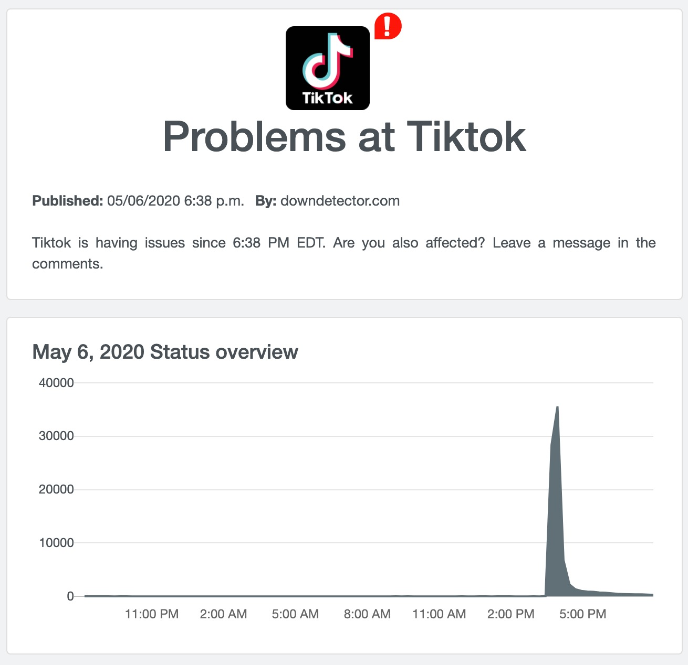

# 2020 活久见：欧美主流 app「熔断」了

> 世界上只有两件事是不可避免的，那就度是税收和死亡。
> 本杰明·富兰克林

在海外做移动端应用开发，有一家公司是几乎不可避免的：facebook（以下简称 FB）。它打造（并且几乎垄断）了从获客到获利（广告）的一条龙服务，使得你无法抵制那巨大的诱惑 —— 前提是你要在自己的 app 里装入 FB 的 SDK。

在 app 里装第三方的 SDK，享受很多「免费」的服务集成，在业内并不是什么新鲜事。开发者们，尤其是中小开发者，对于来自像 FB 这样的大厂的，开源的，并且不得不用的 SDK，天然有一种信任感：那么多人都在用，总不会出问题吧。

然而，今天（5/6/2020）美国西海岸时间下午 15:30 左右（最早的问题可以追溯到 14:44，因为这是一个滚动升级），所有使用了 FB SDK 的应用遭遇大面积崩溃，那场面，是相当壮观：


其中包括海外版抖音，目前风头正劲的 TikTok，以及大家经常使用的 Spotify，Pinterest 等 app：




史诗级的崩溃数量！​真是活久见啊！​也许工程师觉得只是金融制造业的兄弟们受罪，大多数互联网公司还歌舞升平，正义感爆棚，于是挥刀自宫一下？（纯属调侃）

如果这样的图表对你来说还不直观，那么这个程序员的「哭诉」应该足够震撼了[4]：

> Our crash is happening to 40% of new app starts. It has not dropped yet.
> 我们新 app 的启动崩溃率达到了 40%。并且没有下降的趋势。

大厂的 app 用户骂几句难听的也就罢了，因为该用还得用，但小团队的 app 给新用户这样的第一印象，估计这些用户的心就再也难以挽回了吧（1 星差评+卸载）。

一时间，twitter 上炸了锅，飞来飞去的锅最终扣到了 FB 头上：


（翻译：都别 BB 了，如果你的 app 现在各种闪退，这锅是 FB SDK 的）

在 hacker news 上，程序员们一方面用专业的态度给小白解释为什么你跟着 TikTok 们吃着火锅唱着歌，闪退的锅要 FB 来背，另一方面在探讨一个直指人心的问题：对于那些不使用 FB 广告，仅仅使用 FB 登录的功能的 app（如 spotify），是否该回归到原始的 oAuth？

To be or not to be，这永远都是个难题。oAuth 的用户体验比 SDK 差出了一个数量级，骤然退回去，伤了用户体验，那是万万不行的；​然而用 SDK，则总会有种被人扼住咽喉的感觉 —— 就如今天发生的黑天鹅事件。更何况，SDK 会不明不白地把你的用户的信息以某种形式告知 FB，于是，你的用户数据替 FB 充实了它的社交图谱。对于 app 开发者来说，在自己的 app 里每安装一个 SDK，就好像使用吸星大法吸食了外来的内力，你不知道它们什么时候，会以何种方式反噬。所以我司的铁训是：

> 使用第三方 SDK 是极度危险的，要慎之又慎！

有好事的同学可能会问：facebook 究竟做了什么修改，让大家一起完蛋？我们看这个 github ticket 的分析[4]：


对应客户端的 crash 是：

```objectc
Fatal Exception: NSInvalidArgumentException
-[__NSCFBoolean objectForKeyedSubscript:]: unrecognized selector sent to instance 0x200729d00
-[NSOrderedSet initWithSet:copyItems:]
```

我没有具体研究这个 crash 的来龙去脉，但如果这位仁兄分析得没错的话，就是说 FB 后端工程师做了一个更新，把本来应该传回给客户端的一个字典结构的数据，传成了布尔值：

```
"restrictive_data_filter_params" = "{"is_health_app":false}"
```

这里，`is_health_app` 本来应该传一个字典，结果传成了 false。如果原因真是这么奇葩，那么我非常好奇这样的代码是怎么通过 code review，又是怎么通过 CI 的，所以我也留了个言：


我个人的感觉是，这样的问题，程序员负有责任，但不该是主要的背锅侠。更深层次的问题在于整个流程：

1. 代码命名问题：为什么一个字典结构要用 `is_health_app` 这样明显是布尔值的名字？
2. 类型安全问题：为什么服务器 API 返回的数据没有类型检查（这个问题很容易被 typechecker 第一时间捕获）？
3. 单元测试问题：为什么 unit testing 和 CI 没有捕获到？是 test case 缺失么？还有没有类似的缺失？
4. 代码审查问题：为什么 code review 没人发现？似乎有个老司机把关，这个 bug 也难逃一劫。

期待 FB 过两天会有完整的事后分析。

这个事件带给我们什么经验教训呢？我认为下面两点至关重要：

1. 对第三方 SDK 的使用要极度慎重：要么离了它你会死，要么有了它可以对你的营收或者用户增长有本质的帮助，否则，能不用则不用。
2. 服务端 API 返回的结果一定要有类型检查！如果可能，尽量使用强类型。如 GraphQL，gRPC。

## One more thing

这是事故带来了一个大家都没有意想到的负面效果：google 的 crashlytics 竟然被拖累挂掉了。我猜大致的原因是 google firebase 团队也没见过这么海量的 crash（又是史诗级别的活久见），导致整个处理 crash report 的 pipeline 被严重阻塞（可能达到了设计上的上限），连云服务所一直称道的可伸缩性都无法解决。结果，十几个小时过去了，目前 crashlytics 还没有恢复。


## 参考文献

1. downdetector: https://downdetector.com/
2. twitter: https://twitter.com/reneritchie/status/1258177289436770305
3. hacker news: https://news.ycombinator.com/item?id=23097459
4. github ticket: https://github.com/facebook/facebook-ios-sdk/issues/1373
